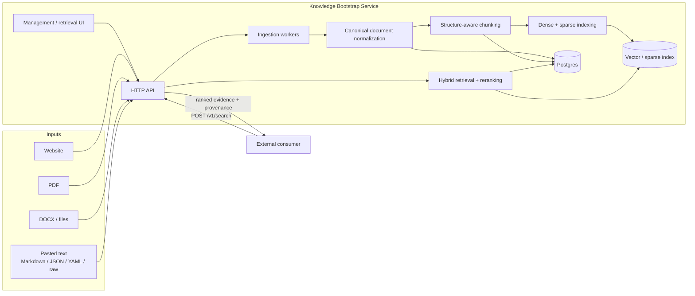
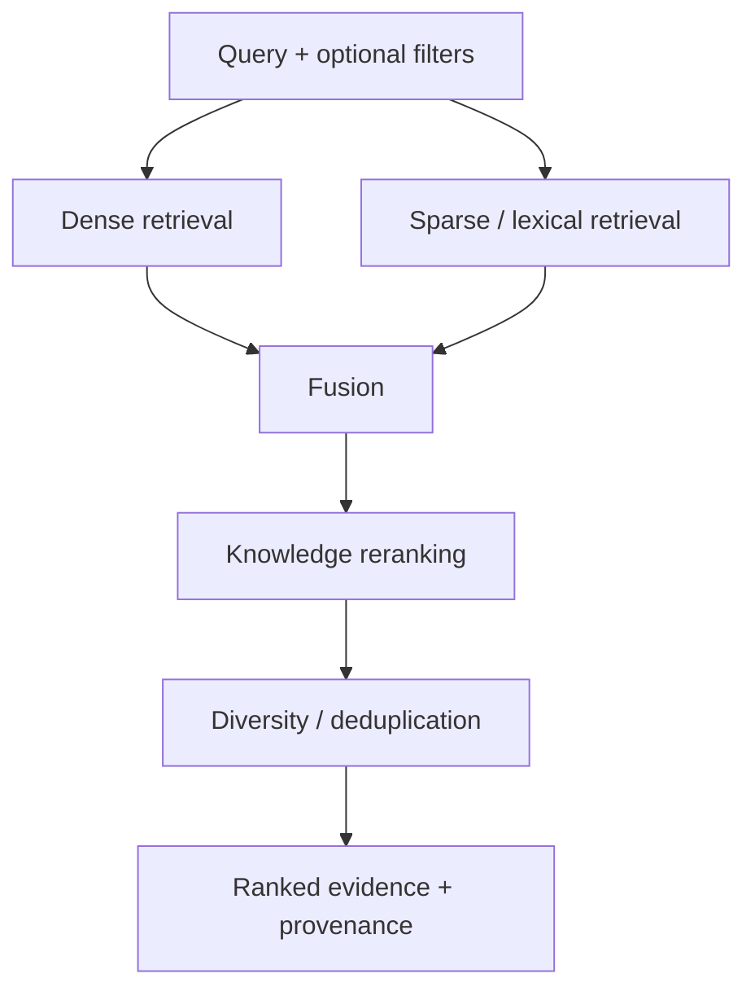
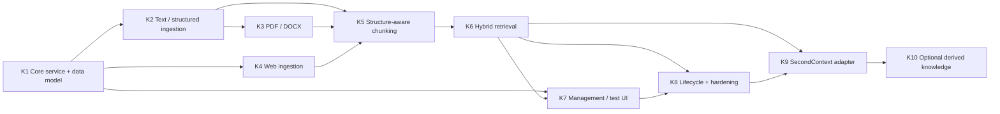
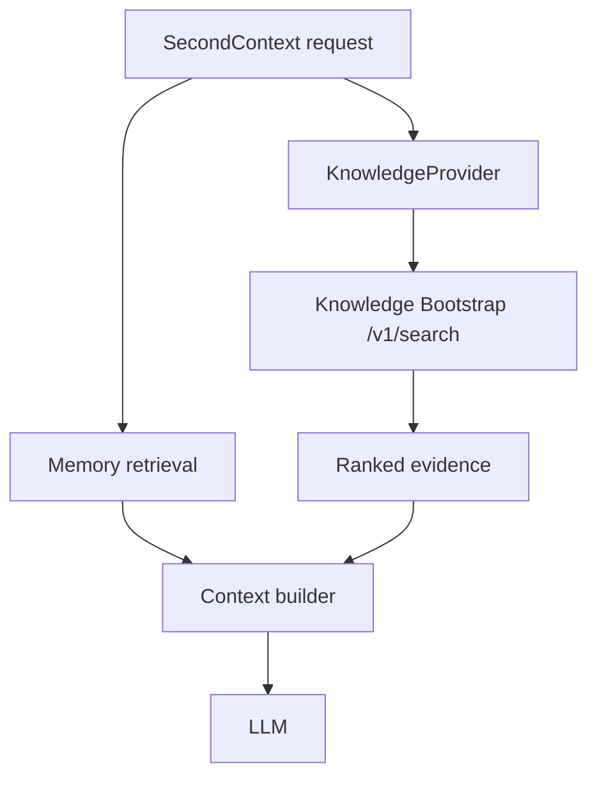
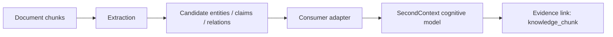

# Knowledge Bootstrap Service — Implementation Plan

Created: 2026-10-04

Status: Proposed

Track: Standalone / parallel to SecondContext

## 1. Objective

Build a standalone knowledge-bootstrap service that can ingest durable reference material, normalize and chunk it, index it for hybrid retrieval, and expose grounded evidence through a small HTTP API.

The service must be useful on its own. SecondContext integration is a later adapter milestone, not a prerequisite for ingestion, indexing, search, source management, or evaluation.

Supported bootstrap inputs should include:

- accessible HTTP/HTTPS websites;
- PDFs;
- DOCX documents;
- Markdown;
- JSON;
- YAML;
- plain text;
- pasted structured or unstructured text.

The service should answer one core question well:

> Given a query and optional filters, return the most relevant pieces of source-backed knowledge together with enough provenance to inspect where each result came from.

## 2. Product boundary

Knowledge is durable reference material about the world. It is not episodic memory and should not inherit memory-specific lifecycle or ranking semantics.

Examples:

- `Production deployments require two approvers.` from an engineering handbook is **knowledge**.
- `Alex asked me to narrow yesterday's deployment review.` is **episodic memory** in a system such as SecondContext.
- `Alex tends to prefer narrow infrastructure review scopes.` may be a later **derived inference**, supported by explicit evidence.

The standalone service owns:

- sources;
- documents;
- parsing and normalization;
- chunks;
- embeddings and sparse representations;
- retrieval;
- provenance;
- source refresh and deletion;
- ingestion status and errors;
- a small management/debug UI.

It does **not** initially own:

- episodic memories;
- people models;
- beliefs;
- user preference inference;
- cognitive graph mutation;
- agent orchestration.

## 3. Architectural principles

1. **The service is independently deployable.** No SecondContext database or internal package is required.
2. **Postgres is canonical.** Vector/search indexes are rebuildable projections.
3. **Evidence remains traceable.** Every returned chunk can be traced to its source and document location.
4. **Ingestion is asynchronous and durable.** Long-running work is represented by jobs rather than long HTTP requests.
5. **Parsers converge on one canonical document representation.** Chunking and indexing are format-agnostic downstream.
6. **Web ingestion is a security boundary.** URL fetching is SSRF-resistant and aggressively bounded.
7. **Knowledge does not decay like memory.** Retrieval emphasizes relevance, source structure, and optional freshness rather than episodic recency.
8. **Integration happens through APIs.** Consumers search the service; they do not read its database or Qdrant collection directly.

## 4. Target architecture



## 5. Recommended deployment boundary

Prefer a separate application and database from SecondContext.

```text
knowledge-bootstrap service
  ├── Postgres database/schema
  ├── Qdrant collection(s)
  ├── ingestion worker(s)
  ├── HTTP API
  └── minimal UI

SecondContext
  └── HTTP KnowledgeProvider adapter
```

The two systems may share infrastructure deployments, but they should not share canonical tables.

For Qdrant, a dedicated collection such as `knowledge_chunks` is preferred. SecondContext should call the service API rather than querying that collection directly.

## 6. Canonical data model

### 6.1 `knowledge_sources`

Represents one user-managed ingestion origin.

Minimum fields:

```text
id
owner_id              # tenant/user/workspace identifier as appropriate
kind                  # url | file | text
name
source_uri            # URL or original filename when applicable
content_type
format                # html | pdf | docx | markdown | json | yaml | text
status                # pending | fetching | parsing | chunking | indexing | ready | failed
config_json           # crawl/parser settings
metadata_json
content_hash
created_at
updated_at
last_ingested_at
```

### 6.2 `knowledge_documents`

A source can yield one or many logical documents. A PDF, upload, or pasted note normally yields one document; a website crawl can yield multiple pages.

```text
id
source_id
owner_id
uri
title
mime_type
raw_content_or_ref
text_content
content_hash
metadata_json
created_at
updated_at
```

### 6.3 `knowledge_chunks`

Canonical retrieval units. Search indexes reference these IDs.

```text
id
document_id
source_id
owner_id
ordinal
text
heading_path
page_start
page_end
token_count
content_hash
created_at
updated_at
```

### 6.4 `knowledge_ingestion_jobs`

Durable progress and failure state for ingestion/refresh operations.

```text
id
source_id
owner_id
status
stage
documents_found
documents_processed
chunks_created
error_code
error_detail
started_at
finished_at
```

## 7. Canonical document representation

All parsers should emit a common internal document model before chunking.

Conceptually:

```json
{
  "title": "Engineering Handbook",
  "uri": "https://docs.example.com/engineering",
  "format": "html",
  "metadata": {},
  "blocks": [
    {
      "type": "heading",
      "level": 1,
      "text": "Deployments"
    },
    {
      "type": "paragraph",
      "text": "Production deployments require...",
      "page": null
    }
  ]
}
```

The precise implementation can differ, but chunking must not need to know whether a block originated in PDF, DOCX, HTML, or Markdown.

## 8. Parsing strategy

### Text / Markdown

- preserve headings and section hierarchy;
- preserve paragraph boundaries;
- retain fenced code blocks and lists when useful;
- avoid unnecessary LLM transformation.

### JSON / YAML

- parse using deterministic parsers;
- normalize into a stable readable representation;
- retain structural paths as metadata where useful;
- reject pathological nesting/size before expensive processing;
- do not convert structured data to invented prose with an LLM.

### PDF

First implementation:

- digital-text extraction only;
- retain page boundaries;
- normalize paragraphs/headings where reasonably detectable;
- preserve page range provenance.

OCR for scanned/image-only PDFs is explicitly post-MVP.

### DOCX

Extract and preserve:

- headings;
- paragraphs;
- lists;
- tables;
- document metadata where useful.

Visual fidelity is not required; semantic fidelity is.

### HTML / websites

- extract main page content rather than navigation/chrome where possible;
- preserve title, canonical URL, headings, and useful link metadata;
- first milestone supports static HTTP content only;
- pages that require JavaScript rendering should report low/unsupported extractability rather than silently indexing empty content.

## 9. Website ingestion security contract

The fetcher must be treated as an SSRF boundary from the first implementation.

Required controls:

- HTTP/HTTPS only;
- resolve hostnames before connecting;
- reject loopback, private/RFC1918, link-local, multicast, unspecified, metadata-service, and other non-public targets;
- validate every redirect target again;
- defend against DNS rebinding by validating resolved connection targets appropriately;
- cap request duration;
- cap response bytes;
- cap redirects;
- cap crawl page count and depth;
- cap concurrent requests;
- restrict accepted content types;
- normalize and deduplicate URLs;
- define a conservative crawl-delay/concurrency policy;
- define and document robots.txt behavior before enabling broad crawling.

Do not add a headless browser to the first implementation.

## 10. Chunking strategy

Do not use one fixed-size algorithm for every format.

### Structured content

Markdown, HTML, and DOCX should primarily chunk on heading/section boundaries.

### Unstructured content

PDF and raw text should primarily chunk on paragraph boundaries, combining paragraphs until the target size is reached.

Initial configurable defaults:

```text
target size: 500–800 tokens
hard maximum: ~1,200 tokens
```

Use overlap sparingly. Prefer structural ancestry over blind fixed overlap.

Each chunk should retain:

- source ID;
- document ID;
- ordinal;
- heading path;
- page number/range where available;
- token count;
- stable content hash;
- URI/title metadata needed for provenance.

Stable chunk hashes should allow unchanged chunks to retain identity across refreshes when practical.

## 11. Search index model

Use a dedicated `knowledge_chunks` collection/index initially.

Suggested vector payload:

```json
{
  "kind": "knowledge",
  "owner_id": "...",
  "source_id": "...",
  "document_id": "...",
  "chunk_id": "...",
  "title": "...",
  "url": "...",
  "heading_path": "...",
  "page_start": 37,
  "page_end": 38,
  "format": "pdf",
  "content_hash": "..."
}
```

Canonical chunk text and lifecycle state remain in Postgres.

## 12. Retrieval model

Search should combine dense and lexical/sparse retrieval and then rerank knowledge-specific candidates.



Knowledge ranking should emphasize:

- semantic relevance;
- lexical relevance;
- section/title relevance;
- source relevance/priority where configured;
- optional query/goal metadata;
- diversity across sections/documents;
- weak freshness only where freshness is semantically useful.

Old reference material must not become irrelevant merely because it is old.

## 13. Core API

Version the standalone API from the beginning.

### Source management

```text
POST   /v1/sources
GET    /v1/sources
GET    /v1/sources/{id}
DELETE /v1/sources/{id}
POST   /v1/sources/{id}/refresh
```

`POST /v1/sources` should support:

1. URL JSON payload;
2. multipart file upload;
3. pasted-text JSON payload with optional `format: auto`.

### Document inspection

```text
GET /v1/sources/{id}/documents
GET /v1/documents/{id}
GET /v1/documents/{id}/chunks
```

### Job inspection

```text
GET /v1/jobs/{id}
```

### Retrieval

```text
POST /v1/search
```

Example request:

```json
{
  "query": "How do we roll back a failed production deployment?",
  "limit": 8,
  "filters": {
    "source_ids": [],
    "tags": []
  }
}
```

Example response:

```json
{
  "results": [
    {
      "chunk_id": "chk_123",
      "document_id": "doc_42",
      "source_id": "src_7",
      "score": 0.91,
      "text": "To roll back a production deployment...",
      "title": "Engineering Handbook",
      "section": "Deployment > Rollback",
      "page": 72,
      "uri": "https://docs.example.com/deployments"
    }
  ]
}
```

Long-running ingestion should return a durable source/job identifier promptly. Polling is sufficient for v1; WebSockets/SSE are not required.

## 14. Minimal UI

The standalone application should include a deliberately simple UI for both management and retrieval debugging.

Primary source screen:

```text
Knowledge

Sources                          Test retrieval
----------------------------     ------------------------------
Engineering Handbook.pdf         [ How do deployments work? ]
Product Docs
https://docs.example.com         [ Search ]

                                1. Deployment > Overview
+ Add source                       Engineering Handbook, p. 21
```

`Add source` should support three modes:

- Website;
- File;
- Paste text.

The source list should show:

- name/title;
- source type;
- status;
- document count;
- chunk count;
- last ingested/refreshed time;
- last error where applicable.

A source detail view should expose documents, chunks/provenance, ingestion state, refresh, and deletion.

A **Test retrieval** interface is part of the MVP because it makes the service independently testable before any external integration exists.

## 15. Refresh and deletion semantics

### Refresh

A source refresh should:

1. fetch/re-read the source;
2. compute source/document hashes;
3. avoid reprocessing unchanged content where possible;
4. deterministically re-chunk changed documents;
5. update Postgres canonical state;
6. update/rebuild affected search points;
7. remove stale chunks that no longer exist;
8. leave the source in a coherent recoverable state after partial failure.

### Delete

Deleting a source must remove or tombstone:

- source row;
- documents;
- chunks;
- derived search-index points;
- ingestion jobs according to retention policy.

Deletion must be tenant-safe and retryable. Search must never return chunks from a source whose canonical deletion has completed.

## 16. Observability and evaluation

At minimum, expose:

- ingestion stage/status;
- parser/fetch error codes;
- document/chunk counts;
- indexing failures;
- retrieval score breakdown where feasible;
- provenance for every result.

Create a small evaluation corpus early.

Measure initially:

- parser correctness via fixtures;
- deterministic chunking;
- retrieval precision@k;
- provenance correctness;
- source deletion correctness;
- refresh correctness;
- answer groundedness manually when testing with an LLM consumer.

A key end-to-end demo should be:

> Ingest a small handbook/spec, then answer questions using `/v1/search` before any SecondContext interaction history exists.

## 17. Implementation milestones



### K1 — Core service and canonical data model

Build the standalone app skeleton, database migrations, ownership model, source/document/chunk/job models, health endpoints, and source/job state machine.

**Exit criterion:** a source and job can be created, inspected, and transitioned without any parser or vector index.

### K2 — Text and structured ingestion

Implement pasted text, TXT, Markdown, JSON, and YAML ingestion with deterministic normalization and limits.

**Exit criterion:** supported textual formats produce canonical documents and deterministic chunks-ready input.

### K3 — PDF and DOCX parsing

Add digital PDF and DOCX parsing with page/section provenance and hostile/malformed-file bounds.

**Exit criterion:** representative fixtures are parsed deterministically with useful provenance.

### K4 — Website ingestion

Implement SSRF-safe single-page ingestion first, then bounded same-path/same-host crawling.

**Exit criterion:** static websites can be ingested safely with tested redirect/network/content limits.

### K5 — Structure-aware chunking and indexing pipeline

Implement canonical chunking, stable hashes, metadata propagation, embedding/sparse generation, and rebuildable index writes.

**Exit criterion:** every supported source type yields inspectable canonical chunks and searchable index points.

### K6 — Hybrid retrieval

Implement `/v1/search`, dense + sparse fusion, knowledge-specific reranking, filters, deduplication/diversification, and provenance.

**Exit criterion:** the evaluation corpus demonstrates useful retrieval and correct source attribution.

### K7 — Management and retrieval-test UI

Implement source list, add-source flows, job progress, source detail, refresh/delete actions, and interactive test retrieval.

**Exit criterion:** the standalone service is usable without external tools or SecondContext.

### K8 — Lifecycle, recovery, and operational hardening

Finish refresh/delete semantics, reconciliation/retry paths, abuse tests, backup/rebuild docs, observability, and end-to-end evaluation.

**Exit criterion:** canonical state and search projections can recover cleanly from partial failures.

### K9 — SecondContext retrieval adapter

Add the smallest possible integration surface to SecondContext.

SecondContext should define a provider interface conceptually similar to:

```text
KnowledgeProvider.Search(ctx, query, filters, limit) -> []KnowledgeEvidence
```

The first provider implementation calls `POST /v1/search` over HTTP.



Integration requirements:

- knowledge retrieval and memory retrieval run independently;
- failure of the external knowledge service degrades gracefully;
- the context packet labels knowledge separately from memory/beliefs;
- provenance is preserved into debug/context output;
- knowledge can be disabled independently for evaluation;
- no direct database or Qdrant coupling is introduced.

**Exit criterion:** SecondContext can consume knowledge evidence through HTTP without the knowledge service importing any SecondContext internals.

### K10 — Optional derived-knowledge bridge

Only begin after grounded retrieval is demonstrably useful.

The knowledge service may optionally extract candidate:

- entities;
- people;
- topics;
- claims;
- relationships.

These remain **candidate derived knowledge** with evidence links to `knowledge_chunk` IDs. They should be exposed through an API/event contract rather than directly mutating SecondContext tables.



Source refresh/deletion must make it possible to retract or recompute derived assertions whose evidence disappeared.

## 18. Explicitly deferred features

Post-MVP candidates:

- OCR for scanned/image-only PDFs;
- JavaScript-rendered websites via an isolated browser service;
- additional office/document formats;
- scheduled source refresh;
- source trust/priority controls;
- team sharing/permissions;
- external object/blob storage for original large files;
- incremental document-diff ingestion;
- cross-encoder/custom reranking;
- richer derived entity/claim extraction;
- source contradiction analysis.

## 19. MVP completion criteria

The standalone track is considered complete when:

- a user can add accessible websites, PDF, DOCX, Markdown, JSON, YAML, TXT, or pasted text;
- ingestion runs through durable, inspectable jobs;
- canonical documents and chunks are stored in Postgres;
- dense + sparse retrieval returns grounded chunks with provenance;
- source refresh and deletion safely update canonical state and search projections;
- website ingestion is bounded and SSRF-resistant;
- the UI can manage sources and test retrieval without SecondContext;
- the search index can be rebuilt from canonical state;
- an external consumer can integrate using `/v1/search` only;
- SecondContext integration, when added, uses a provider/HTTP boundary rather than shared storage.

## 20. Suggested implementation order

1. K1 — core service/data model;
2. K2 — pasted/text/Markdown/JSON/YAML ingestion;
3. K5 foundations — canonical chunk representation and hashing;
4. K3 — PDF/DOCX;
5. K4 — safe web ingestion;
6. finish K5 — index pipeline;
7. K6 — hybrid retrieval;
8. K7 — management/test UI;
9. K8 — lifecycle and hardening;
10. K9 — SecondContext adapter;
11. K10 — derived knowledge only after retrieval quality is proven.

This ordering intentionally keeps the two tracks independent for as long as possible.
