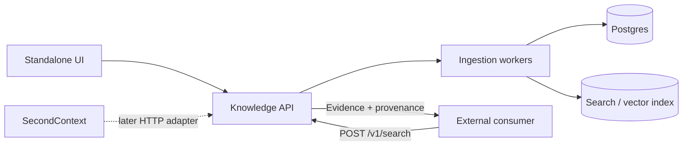

# Knowledge Bootstrap Service — TODO

Status: K1, K2 and K3 implemented; remaining milestones proposed

Track: Standalone / parallel to SecondContext

## Goals

- [ ] Build an independently deployable knowledge-bootstrap service.
- [ ] Ingest websites, PDFs, DOCX, Markdown, JSON, YAML, plain text, and pasted unstructured content.
- [ ] Keep canonical source/document/chunk state separate from any consumer such as SecondContext.
- [ ] Expose grounded hybrid retrieval through a small versioned HTTP API.
- [ ] Preserve provenance from every returned chunk to source/document location.
- [ ] Make ingestion observable, bounded, retryable, owner/tenant-isolated, and safe against hostile URLs or malformed files.
- [ ] Provide a minimal management and test-retrieval UI so the service is useful before SecondContext integration.

## Architectural boundary

The service stores and retrieves **reference knowledge**. It does not initially own episodic memory, beliefs, person models, or cognitive graph mutation.



---

## K1 — Core service and canonical data model

Implemented in [`services/knowledge-bootstrap`](services/knowledge-bootstrap/README.md) using
FastAPI, SQLAlchemy, and Alembic. The service is an optional Compose profile, shares the
existing Postgres deployment through a separate database, and does not change SecondContext
startup. K1 persists pending jobs; K2 now processes textual inputs. The Jinja2 UI remains
in a later milestone.

### Project foundation

- [x] Create standalone service/repository/module boundary.
- [x] Add configuration loading and validation.
- [x] Add structured logging.
- [x] Add health/readiness endpoints.
- [x] Add Postgres connection and migrations.
- [x] Add vector/search backend configuration.
- [x] Define ownership/tenant model without depending on SecondContext identity tables.
- [x] Add API version prefix `/v1`.

### Canonical tables

- [x] Add `knowledge_sources` migration/model.
- [x] Add `knowledge_documents` migration/model.
- [x] Add `knowledge_chunks` migration/model.
- [x] Add `knowledge_ingestion_jobs` migration/model.
- [x] Add `owner_id`/tenant ownership to every canonical row.
- [x] Add source kind values:
  - [x] `url`;
  - [x] `file`;
  - [x] `text`.
- [x] Add source/job state values:
  - [x] `pending`;
  - [x] `fetching`;
  - [x] `parsing`;
  - [x] `chunking`;
  - [x] `indexing`;
  - [x] `ready`;
  - [x] `failed`.
- [x] Add source URI/original filename.
- [x] Add MIME/content type.
- [x] Add detected format.
- [x] Add source/parser config JSON.
- [x] Add source/document/chunk content hashes.
- [x] Add timestamps and last-ingested timestamp.
- [x] Add useful uniqueness and owner-scoped indexes.

### Job state machine

- [x] Implement durable ingestion job creation.
- [x] Implement legal job-stage transitions.
- [x] Record documents found/processed.
- [x] Record chunks created.
- [x] Record stable error code + human-readable detail.
- [x] Make retry semantics explicit.
- [x] Ensure retries are idempotent where practical.

### K1 exit criteria

- [x] A source can be created without SecondContext.
- [x] A durable ingestion job can be created and inspected.
- [x] Ownership isolation is covered by tests.
- [x] No parser/vector-index dependency is required to exercise the core models/API.

---

## K2 — Text and structured ingestion

Implemented in the optional service: pasted JSON requests and `/v1/sources/upload` feed a
bounded polling worker. TXT/Markdown/JSON/YAML produce canonical documents with semantic
blocks, heading ancestry or JSON Pointer paths in metadata. Parsed jobs pause at `chunking`
with one processed document; actual chunks, indexing and `ready` completion belong to K5.
No new database migration, LLM, Qdrant connection or SecondContext dependency is required.

### Pasted text

- [x] Implement pasted-text source creation.
- [x] Support optional source name/title.
- [x] Support `format: auto`.
- [x] Allow explicit format override.
- [x] Enforce maximum input bytes.
- [x] Normalize line endings/encoding safely.

### Plain text

- [x] Parse TXT as paragraph-oriented text.
- [x] Preserve meaningful blank-line boundaries.
- [x] Reject binary/obviously invalid text input.

### Markdown

- [x] Preserve heading hierarchy.
- [x] Preserve paragraphs.
- [x] Preserve lists where useful.
- [x] Preserve fenced code blocks as semantic blocks.
- [x] Avoid unnecessary Markdown-to-prose LLM conversion.

### JSON

- [x] Parse deterministically.
- [x] Reject invalid JSON with stable error codes.
- [x] Bound total bytes.
- [x] Bound nesting depth.
- [x] Normalize to stable readable text.
- [x] Preserve structural paths as metadata where useful.

### YAML

- [x] Parse with safe YAML settings.
- [x] Reject unsafe/custom object construction.
- [x] Bound aliases/expansion/nesting.
- [x] Normalize to stable readable text.
- [x] Preserve structural paths where useful.

### Format detection

- [x] Detect likely Markdown/JSON/YAML/plain text for pasted content.
- [x] Record detected format.
- [x] Allow explicit user override.
- [x] Add ambiguous-format fixtures.

### Tests

- [x] TXT fixtures.
- [x] Markdown fixtures.
- [x] JSON fixtures.
- [x] YAML fixtures.
- [x] Malformed structured data tests.
- [x] Deep-nesting/resource-abuse tests.
- [x] Deterministic normalization tests.

### K2 exit criteria

- [x] Pasted and uploaded text formats produce canonical documents.
- [x] Structured formats remain faithful to original structure.
- [x] No LLM is required for normalization.

---

## K3 — PDF and DOCX parsing

Implemented through `/v1/sources/upload` with content signatures and consistent PDF/DOCX
format hints. Bounded original bytes remain in Postgres for retry/refresh. A disposable parser
process enforces wall time, CPU, memory and output limits; PDFs retain page provenance and
DOCX retains heading ancestry, paragraphs, lists and readable tables. Scanned/near-empty PDFs
fail explicitly with `pdf_text_unavailable`; OCR remains deferred. Migration
`0002_source_bytes` extends only the optional service database. Parsed jobs still pause at
`chunking` for K5.

### PDF

- [x] Implement digital-text PDF extraction.
- [x] Preserve page numbers/ranges.
- [x] Preserve paragraph boundaries where possible.
- [x] Detect empty/near-empty extraction.
- [x] Return an explicit unsupported/scanned indication rather than silently indexing empty text.
- [x] Enforce PDF byte limits.
- [x] Enforce parser timeout.
- [x] Enforce decompression/object/resource limits where library support permits.
- [x] Add malformed/corrupt PDF tests.
- [x] Add representative multi-page fixtures.

### DOCX

- [x] Extract headings.
- [x] Extract paragraphs.
- [x] Extract lists.
- [x] Extract tables into readable deterministic text.
- [x] Preserve section hierarchy.
- [x] Enforce upload byte limits.
- [x] Defend against ZIP bombs/oversized decompression.
- [x] Add malformed DOCX tests.
- [x] Add representative fixture coverage.

### File upload API

- [x] Add multipart upload to `POST /v1/sources` or a dedicated upload route.
- [x] Detect/validate MIME type and extension without trusting either blindly.
- [x] Preserve original filename as metadata only.
- [x] Define temporary-file cleanup behavior.
- [x] Define whether original bytes are stored or discarded after parsing.

### K3 exit criteria

- [x] PDF and DOCX produce canonical documents with useful provenance.
- [x] Scanned PDFs fail clearly instead of producing misleading empty knowledge.
- [x] Resource-abuse tests cover large/malformed containers.

---

## K4 — Website ingestion and crawler safety

### Single-page ingestion first

- [ ] Implement HTTP/HTTPS URL source creation.
- [ ] Fetch a single static page before implementing crawling.
- [ ] Extract main page content.
- [ ] Preserve page title.
- [ ] Preserve requested URL.
- [ ] Preserve canonical/final URL.
- [ ] Preserve retrieved timestamp.
- [ ] Preserve HTTP status and content type.
- [ ] Compute content hash.

### SSRF controls

- [ ] Permit only HTTP/HTTPS.
- [ ] Resolve hostname before connection.
- [ ] Reject loopback addresses.
- [ ] Reject RFC1918/private ranges.
- [ ] Reject link-local ranges.
- [ ] Reject multicast/unspecified ranges where applicable.
- [ ] Reject cloud metadata targets.
- [ ] Reject hostnames resolving to forbidden addresses.
- [ ] Revalidate every redirect target.
- [ ] Add DNS-rebinding-resistant connection validation appropriate to the HTTP stack.
- [ ] Bound redirect count.
- [ ] Bound request timeout.
- [ ] Bound response bytes.
- [ ] Restrict accepted content types.

### Bounded crawler

- [ ] Add crawl scope `page`.
- [ ] Add crawl scope `path`.
- [ ] Add crawl scope `host`/`domain` only after `path` is reliable.
- [ ] Add max pages.
- [ ] Add max depth.
- [ ] Bound concurrent fetches.
- [ ] Normalize URLs.
- [ ] Deduplicate crawl targets.
- [ ] Strip fragments.
- [ ] Decide query-string normalization policy.
- [ ] Add conservative crawl delay/concurrency behavior.
- [ ] Define/document robots.txt policy before broad crawling.

### Unsupported rendering

- [ ] Do not add a headless browser in the first implementation.
- [ ] Detect low/empty extracted content.
- [ ] Surface a clear "requires JavaScript or unsupported content" state where appropriate.

### Tests

- [ ] SSRF private-target tests.
- [ ] Redirect-to-private-target tests.
- [ ] Hostname-resolves-private tests.
- [ ] Timeout tests.
- [ ] Oversized response tests.
- [ ] Redirect loop tests.
- [ ] Crawl page/depth bound tests.
- [ ] Duplicate URL tests.
- [ ] Unsupported content-type tests.

### K4 exit criteria

- [ ] Static public pages ingest safely.
- [ ] Redirects and crawl targets cannot bypass network restrictions.
- [ ] Crawl scope and resource bounds are demonstrably enforced.

---

## K5 — Canonical representation, structure-aware chunking, and indexing pipeline

### Canonical document model

- [ ] Define parser-neutral document/block representation.
- [ ] Include title/URI/format metadata.
- [ ] Include heading blocks.
- [ ] Include paragraph blocks.
- [ ] Include code/list/table blocks where useful.
- [ ] Include page provenance where available.
- [ ] Make all parsers emit this representation.

### Chunking

- [ ] Chunk Markdown/HTML/DOCX primarily on heading/section boundaries.
- [ ] Chunk PDF/raw text primarily on paragraph boundaries.
- [ ] Start with configurable target size around 500–800 tokens.
- [ ] Start with configurable hard maximum around 1,200 tokens.
- [ ] Avoid fixed overlap when structural ancestry is sufficient.
- [ ] Add limited overlap for long unstructured runs only where justified.
- [ ] Preserve heading path.
- [ ] Preserve page/range.
- [ ] Preserve source/document IDs.
- [ ] Store ordinal and token count.
- [ ] Compute stable chunk content hashes.
- [ ] Make re-chunking deterministic for unchanged input/config.

### Chunking tests

- [ ] Tiny sections.
- [ ] Oversized sections.
- [ ] Deep heading hierarchy.
- [ ] Tables.
- [ ] Code blocks.
- [ ] Page transitions.
- [ ] Long unstructured paragraphs.
- [ ] Deterministic repeat run.

### Search-index projection

- [ ] Create dedicated `knowledge_chunks` collection/index.
- [ ] Index dense vector per chunk.
- [ ] Index sparse/lexical representation per chunk.
- [ ] Keep canonical text/state in Postgres.
- [ ] Include owner/source/document/chunk IDs in index payload.
- [ ] Include title/URL/heading/page/format/content-hash metadata.
- [ ] Implement idempotent upsert.
- [ ] Implement stale-point deletion.
- [ ] Implement full rebuild from Postgres.

### Cross-store failure handling

- [ ] Decide commit order between Postgres and search projection.
- [ ] Persist enough state to retry failed index writes.
- [ ] Add reconciliation command/job.
- [ ] Add tests for Postgres-success/index-failure scenarios.
- [ ] Add tests for retry without duplicate canonical chunks.

### K5 exit criteria

- [ ] Every supported input produces canonical, inspectable chunks.
- [ ] Search projection can be rebuilt entirely from Postgres.
- [ ] Partial index failure is recoverable.

---

## K6 — Hybrid retrieval API

### `/v1/search`

- [ ] Implement `POST /v1/search`.
- [ ] Require non-empty query.
- [ ] Support `limit` with server-side maximum.
- [ ] Support owner/tenant isolation.
- [ ] Support source filters.
- [ ] Support document filters.
- [ ] Support format/type filters where useful.
- [ ] Reserve tags/filter extension cleanly even if tags ship later.

### Retrieval

- [ ] Implement dense retrieval.
- [ ] Implement sparse/lexical retrieval.
- [ ] Implement result fusion.
- [ ] Implement knowledge-specific reranking.
- [ ] Do not use episodic-memory recency decay.
- [ ] Consider semantic relevance.
- [ ] Consider lexical relevance.
- [ ] Consider title/heading relevance.
- [ ] Consider configured source priority when added.
- [ ] Use freshness only weakly/optionally.
- [ ] Diversify results so one section/document cannot consume all slots.
- [ ] Deduplicate near-identical chunks.

### Result contract

- [ ] Return `chunk_id`.
- [ ] Return `document_id`.
- [ ] Return `source_id`.
- [ ] Return final score.
- [ ] Return text.
- [ ] Return title.
- [ ] Return section/heading path.
- [ ] Return page/range when available.
- [ ] Return URI/source reference.
- [ ] Return format.
- [ ] Return score components in debug mode where feasible.

### Evaluation

- [ ] Create small retrieval benchmark corpus.
- [ ] Create representative queries.
- [ ] Measure dense-only precision@k.
- [ ] Measure sparse-only precision@k.
- [ ] Measure hybrid precision@k.
- [ ] Check provenance correctness.
- [ ] Add regression tests for known hard queries.

### K6 exit criteria

- [ ] `/v1/search` is useful to an external consumer with no database access.
- [ ] Returned evidence is traceable to canonical sources.
- [ ] Hybrid retrieval demonstrably improves at least some benchmark cases over single-mode retrieval.

---

## K7 — Standalone management and test UI

### Sources page

- [ ] Add minimal `/knowledge` or `/` management UI.
- [ ] Show source name/title.
- [ ] Show source type.
- [ ] Show ingestion status.
- [ ] Show document count.
- [ ] Show chunk count.
- [ ] Show last ingested/refreshed time.
- [ ] Show last error when failed.

### Add source flow

- [ ] Add Website mode.
- [ ] Add File mode.
- [ ] Add Paste text mode.

#### Website form

- [ ] URL.
- [ ] Crawl scope.
- [ ] Max pages.

#### File form

- [ ] File selector or drag/drop.
- [ ] Supported-type guidance.
- [ ] Upload progress/status.
- [ ] Stable error display.

#### Paste form

- [ ] Optional source name.
- [ ] Large text area.
- [ ] Detected format.
- [ ] Optional format override.

### Job/source detail

- [ ] Poll ingestion status; no WebSocket requirement for v1.
- [ ] Show current ingestion stage.
- [ ] Show parser/fetch/indexing error.
- [ ] Show documents.
- [ ] Show chunks/provenance.
- [ ] Add refresh/reindex action.
- [ ] Add delete action with confirmation.

### Test retrieval

- [ ] Add query input.
- [ ] Add optional source filter.
- [ ] Show ranked chunks.
- [ ] Show score.
- [ ] Show title/section/page/URI.
- [ ] Show full chunk text on expansion.
- [ ] Add debug score breakdown toggle if available.

### K7 exit criteria

- [ ] A user can ingest and test knowledge without curl, SQL, Qdrant tools, or SecondContext.

---

## K8 — Refresh, deletion, recovery, evaluation, and hardening

### Refresh semantics

- [ ] Re-read/refetch source.
- [ ] Compute new source/document hashes.
- [ ] Skip unchanged work where practical.
- [ ] Reparse changed documents.
- [ ] Deterministically re-chunk.
- [ ] Preserve stable chunk IDs for unchanged chunks where practical.
- [ ] Upsert changed/new search points.
- [ ] Remove stale points.
- [ ] Leave source recoverable after partial failure.

### Deletion semantics

- [ ] Delete/tombstone source canonically.
- [ ] Delete documents.
- [ ] Delete chunks.
- [ ] Delete derived search points.
- [ ] Decide ingestion-job retention policy.
- [ ] Ensure search never returns a canonically deleted source after deletion completes.
- [ ] Make deletion retries idempotent.

### Operational tooling

- [ ] Add search-index rebuild command/job.
- [ ] Add cross-store reconciliation command/job.
- [ ] Add source reindex command/job.
- [ ] Add backup guidance for Postgres canonical data.
- [ ] Document that search projections are rebuildable.
- [ ] Add metrics for ingestion latency and failures.
- [ ] Add metrics for parser/fetch/index failures.
- [ ] Add metrics for search latency.

### Abuse/hardening tests

- [ ] Very large text input.
- [ ] Deep JSON/YAML nesting.
- [ ] ZIP/DOCX expansion abuse.
- [ ] Malformed PDFs.
- [ ] Hostile/oversized HTML.
- [ ] Slow HTTP server behavior.
- [ ] Excessive redirect chains.
- [ ] Crawl explosion attempts.
- [ ] Cross-owner enumeration/access attempts.

### End-to-end evaluation

- [ ] Ingest a small handbook/spec.
- [ ] Verify source/document/chunk provenance.
- [ ] Run benchmark queries through `/v1/search`.
- [ ] Refresh a changed source and verify stale chunks disappear.
- [ ] Delete a source and verify it is no longer searchable.
- [ ] Rebuild search index from Postgres and compare retrieval.

### K8 exit criteria

- [ ] Canonical state survives/reconciles partial projection failures.
- [ ] Refresh/delete behavior is deterministic and tested.
- [ ] The standalone MVP is operationally usable.

---

## K9 — SecondContext adapter

This milestone belongs at the integration boundary only. The knowledge service itself should not gain dependencies on SecondContext internals.

### SecondContext provider contract

- [ ] Define a `KnowledgeProvider` interface in SecondContext.
- [ ] Keep the interface consumer-oriented, for example:

```text
Search(ctx, query, filters, limit) -> []KnowledgeEvidence
```

- [ ] Define a `KnowledgeEvidence` model containing:
  - [ ] chunk ID;
  - [ ] source/document IDs;
  - [ ] text;
  - [ ] score;
  - [ ] title;
  - [ ] section;
  - [ ] URI;
  - [ ] page/range.

### HTTP implementation

- [ ] Implement provider using `POST /v1/search`.
- [ ] Add timeout.
- [ ] Add bounded result count.
- [ ] Add stable error mapping.
- [ ] Add graceful degradation when knowledge service is unavailable.
- [ ] Avoid direct Postgres access.
- [ ] Avoid direct Qdrant access.

### Context assembly

- [ ] Run memory retrieval and knowledge retrieval independently.
- [ ] Keep separate context budgets.
- [ ] Label reference knowledge separately from episodic context.
- [ ] Preserve source provenance in debug/context output.
- [ ] Add `disable_knowledge` or equivalent independent control.
- [ ] Do not silently overload existing `disable_memory` semantics.
- [ ] Add token-budget arbitration across knowledge, memory, people/topics, and beliefs.
- [ ] Add integration test proving knowledge improves an answer without creating memory items.

### K9 exit criteria

- [ ] SecondContext consumes the service through HTTP only.
- [ ] The knowledge service remains independently deployable and testable.
- [ ] Knowledge failure does not take down ordinary SecondContext response generation.

---

## K10 — Optional derived-knowledge bridge

Begin only after retrieval quality is proven.

### Candidate extraction

- [ ] Extract candidate entities.
- [ ] Extract candidate people.
- [ ] Extract candidate topics.
- [ ] Extract candidate factual claims.
- [ ] Extract candidate relationships.
- [ ] Make extraction optional per source/document.
- [ ] Store `knowledge_chunk` evidence IDs for every candidate assertion.
- [ ] Preserve extraction model/version metadata.

### Consumer boundary

- [ ] Expose candidates through API/event output.
- [ ] Do not write directly to SecondContext canonical tables.
- [ ] Let the consumer decide whether/how candidates become people/topics/beliefs/graph edges.
- [ ] Distinguish documentary claims from episodic observations.
- [ ] Avoid creating person-model observations from generic factual mentions without an explicit semantic rule.

### Retraction and refresh

- [ ] Track which evidence supports each extracted candidate.
- [ ] Retract/recompute candidates when evidence disappears.
- [ ] Handle changed claims after source refresh.
- [ ] Add contradiction tests across sources.
- [ ] Add contradiction tests between documentary evidence and episodic observations in consumers that support both.

### K10 exit criteria

- [ ] Every derived candidate remains auditable back to source chunks.
- [ ] Source deletion/refresh can invalidate stale derived candidates.

---

## Deferred / post-MVP

- [ ] OCR for scanned/image-only PDFs.
- [ ] JavaScript-rendered website ingestion with an isolated browser service.
- [ ] Additional office/document formats.
- [ ] Scheduled source refresh policies.
- [ ] Source-level trust/priority controls.
- [ ] Team sharing/permissions.
- [ ] External object/blob storage for original large files.
- [ ] Incremental document-diff ingestion.
- [ ] Cross-encoder/custom reranking.
- [ ] Richer derived-knowledge extraction.
- [ ] Source contradiction analysis.

---

## MVP deliverables

- [ ] Standalone service runs without SecondContext.
- [ ] PDF, DOCX, Markdown, JSON, YAML, TXT, pasted content, and accessible static web pages can be ingested.
- [ ] Ingestion progress/failures are visible and retryable.
- [ ] Postgres is the canonical source of documents/chunks/jobs.
- [ ] Search index is rebuildable from canonical state.
- [ ] Dense + sparse retrieval returns source-backed chunks with provenance.
- [ ] `/v1/search` is sufficient for an external consumer to use the knowledge base.
- [ ] Refresh updates changed content and removes stale chunks.
- [ ] Delete removes/tombstones canonical content and cleans derived search points.
- [ ] Website ingestion is bounded and SSRF-resistant.
- [ ] Standalone UI supports source management and test retrieval.
- [ ] End-to-end demo works before SecondContext integration exists.
- [ ] SecondContext integration, when implemented, uses an HTTP provider boundary only.

---

## Suggested implementation order

1. [x] K1 — Core service and data model.
2. [x] K2 — Text / Markdown / JSON / YAML ingestion.
3. [ ] K5 foundation — canonical document/chunk model and stable hashing.
4. [x] K3 — PDF / DOCX.
5. [ ] K4 — safe website ingestion.
6. [ ] K5 completion — dense/sparse indexing and recovery.
7. [ ] K6 — hybrid retrieval API.
8. [ ] K7 — management and test-retrieval UI.
9. [ ] K8 — lifecycle, recovery, hardening, and evaluation.
10. [ ] K9 — SecondContext adapter.
11. [ ] K10 — optional derived knowledge only after grounded retrieval is proven.
