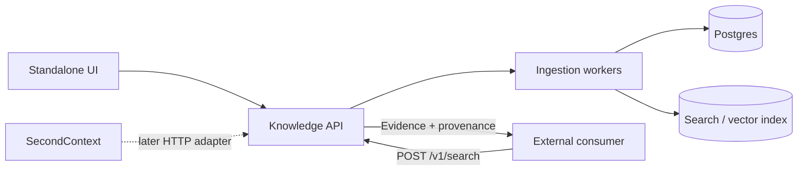

# Knowledge Bootstrap Service — TODO

Status: K1–K9 implemented; remaining milestones proposed

Track: Standalone / parallel to SecondContext

## Goals

- [x] Build an independently deployable knowledge-bootstrap service.
- [x] Ingest websites, PDFs, DOCX, Markdown, JSON, YAML, plain text, and pasted unstructured content.
- [x] Keep canonical source/document/chunk state separate from any consumer such as SecondContext.
- [x] Expose grounded hybrid retrieval through a small versioned HTTP API.
- [x] Preserve provenance from every returned chunk to source/document location.
- [x] Make ingestion observable, bounded, retryable, owner/tenant-isolated, and safe against hostile URLs or malformed files.
- [x] Provide a minimal management and test-retrieval UI so the service is useful before SecondContext integration.

## Architectural boundary

The service stores and retrieves **reference knowledge**. It does not initially own episodic memory, beliefs, person models, or cognitive graph mutation.



---

## K1 — Core service and canonical data model

Implemented in [`services/knowledge-bootstrap`](services/knowledge-bootstrap/README.md) using
FastAPI, SQLAlchemy, and Alembic. The service is an optional Compose profile, shares the
existing Postgres deployment through a separate database, and does not change SecondContext
startup. K1 persists pending jobs; K2 now processes textual inputs. K7 now provides the
Jinja2 management and retrieval UI.

### Project foundation

- [x] Create standalone service/repository/module boundary.
- [x] Add configuration loading and validation.
- [x] Add structured logging.
- [x] Add health/readiness endpoints.
- [x] Add Postgres connection and migrations.
- [x] Add vector/search backend configuration.
- [x] Define ownership/tenant model without depending on SecondContext identity tables.
- [x] Add API version prefix `/v1`.

### Canonical tables

- [x] Add `knowledge_sources` migration/model.
- [x] Add `knowledge_documents` migration/model.
- [x] Add `knowledge_chunks` migration/model.
- [x] Add `knowledge_ingestion_jobs` migration/model.
- [x] Add `owner_id`/tenant ownership to every canonical row.
- [x] Add source kind values:
  - [x] `url`;
  - [x] `file`;
  - [x] `text`.
- [x] Add source/job state values:
  - [x] `pending`;
  - [x] `fetching`;
  - [x] `parsing`;
  - [x] `chunking`;
  - [x] `indexing`;
  - [x] `ready`;
  - [x] `failed`.
- [x] Add source URI/original filename.
- [x] Add MIME/content type.
- [x] Add detected format.
- [x] Add source/parser config JSON.
- [x] Add source/document/chunk content hashes.
- [x] Add timestamps and last-ingested timestamp.
- [x] Add useful uniqueness and owner-scoped indexes.

### Job state machine

- [x] Implement durable ingestion job creation.
- [x] Implement legal job-stage transitions.
- [x] Record documents found/processed.
- [x] Record chunks created.
- [x] Record stable error code + human-readable detail.
- [x] Make retry semantics explicit.
- [x] Ensure retries are idempotent where practical.

### K1 exit criteria

- [x] A source can be created without SecondContext.
- [x] A durable ingestion job can be created and inspected.
- [x] Ownership isolation is covered by tests.
- [x] No parser/vector-index dependency is required to exercise the core models/API.

---

## K2 — Text and structured ingestion

Implemented in the optional service: pasted JSON requests and `/v1/sources/upload` feed a
bounded polling worker. TXT/Markdown/JSON/YAML produce canonical documents with semantic
blocks, heading ancestry or JSON Pointer paths in metadata. K2 commits one processed document
at `chunking`; K5 now consumes that stage through indexing and `ready`. The parser stage
requires no LLM, Qdrant connection or SecondContext dependency.

### Pasted text

- [x] Implement pasted-text source creation.
- [x] Support optional source name/title.
- [x] Support `format: auto`.
- [x] Allow explicit format override.
- [x] Enforce maximum input bytes.
- [x] Normalize line endings/encoding safely.

### Plain text

- [x] Parse TXT as paragraph-oriented text.
- [x] Preserve meaningful blank-line boundaries.
- [x] Reject binary/obviously invalid text input.

### Markdown

- [x] Preserve heading hierarchy.
- [x] Preserve paragraphs.
- [x] Preserve lists where useful.
- [x] Preserve fenced code blocks as semantic blocks.
- [x] Avoid unnecessary Markdown-to-prose LLM conversion.

### JSON

- [x] Parse deterministically.
- [x] Reject invalid JSON with stable error codes.
- [x] Bound total bytes.
- [x] Bound nesting depth.
- [x] Normalize to stable readable text.
- [x] Preserve structural paths as metadata where useful.

### YAML

- [x] Parse with safe YAML settings.
- [x] Reject unsafe/custom object construction.
- [x] Bound aliases/expansion/nesting.
- [x] Normalize to stable readable text.
- [x] Preserve structural paths where useful.

### Format detection

- [x] Detect likely Markdown/JSON/YAML/plain text for pasted content.
- [x] Record detected format.
- [x] Allow explicit user override.
- [x] Add ambiguous-format fixtures.

### Tests

- [x] TXT fixtures.
- [x] Markdown fixtures.
- [x] JSON fixtures.
- [x] YAML fixtures.
- [x] Malformed structured data tests.
- [x] Deep-nesting/resource-abuse tests.
- [x] Deterministic normalization tests.

### K2 exit criteria

- [x] Pasted and uploaded text formats produce canonical documents.
- [x] Structured formats remain faithful to original structure.
- [x] No LLM is required for normalization.

---

## K3 — PDF and DOCX parsing

Implemented through `/v1/sources/upload` with content signatures and consistent PDF/DOCX
format hints. Bounded original bytes remain in Postgres for retry/refresh. A disposable parser
process enforces wall time, CPU, memory and output limits; PDFs retain page provenance and
DOCX retains heading ancestry, paragraphs, lists and readable tables. Scanned/near-empty PDFs
fail explicitly with `pdf_text_unavailable`; OCR remains deferred. Migration
`0002_source_bytes` extends only the optional service database. K3 commits parsed documents
at `chunking`; K5 now continues through indexing and `ready`.

### PDF

- [x] Implement digital-text PDF extraction.
- [x] Preserve page numbers/ranges.
- [x] Preserve paragraph boundaries where possible.
- [x] Detect empty/near-empty extraction.
- [x] Return an explicit unsupported/scanned indication rather than silently indexing empty text.
- [x] Enforce PDF byte limits.
- [x] Enforce parser timeout.
- [x] Enforce decompression/object/resource limits where library support permits.
- [x] Add malformed/corrupt PDF tests.
- [x] Add representative multi-page fixtures.

### DOCX

- [x] Extract headings.
- [x] Extract paragraphs.
- [x] Extract lists.
- [x] Extract tables into readable deterministic text.
- [x] Preserve section hierarchy.
- [x] Enforce upload byte limits.
- [x] Defend against ZIP bombs/oversized decompression.
- [x] Add malformed DOCX tests.
- [x] Add representative fixture coverage.

### File upload API

- [x] Add multipart upload to `POST /v1/sources` or a dedicated upload route.
- [x] Detect/validate MIME type and extension without trusting either blindly.
- [x] Preserve original filename as metadata only.
- [x] Define temporary-file cleanup behavior.
- [x] Define whether original bytes are stored or discarded after parsing.

### K3 exit criteria

- [x] PDF and DOCX produce canonical documents with useful provenance.
- [x] Scanned PDFs fail clearly instead of producing misleading empty knowledge.
- [x] Resource-abuse tests cover large/malformed containers.

---

## K4 — Website ingestion and crawler safety

Implemented in the optional service: authenticated URL JSON registration feeds a bounded
static HTML crawler with `page`, same-path and exact-host scopes. Direct connections pin
validated public DNS addresses and verify peers/TLS hostnames; robots requests and every
redirect use the same safety boundary. Robots wildcard/allow rules, conservative pacing,
page attempts, depth, links/frontier, response/output bytes, time and process resources are
bounded and tested. Canonical pages retain title, requested/final/canonical URL provenance,
retrieval/status/content type, hashes and semantic blocks. Low-text/JavaScript-only content
fails explicitly. No browser, database migration, Qdrant connection or Go dependency is
introduced. Host scope excludes subdomains; registrable-domain expansion remains deferred.
K4 commits parsed documents at `chunking`; K5 now continues through indexing and `ready`.
K8 now removes absent pages safely on authoritative refreshes.

### Single-page ingestion first

- [x] Implement HTTP/HTTPS URL source creation.
- [x] Fetch a single static page before implementing crawling.
- [x] Extract main page content.
- [x] Preserve page title.
- [x] Preserve requested URL.
- [x] Preserve canonical/final URL.
- [x] Preserve retrieved timestamp.
- [x] Preserve HTTP status and content type.
- [x] Compute content hash.

### SSRF controls

- [x] Permit only HTTP/HTTPS.
- [x] Resolve hostname before connection.
- [x] Reject loopback addresses.
- [x] Reject RFC1918/private ranges.
- [x] Reject link-local ranges.
- [x] Reject multicast/unspecified ranges where applicable.
- [x] Reject cloud metadata targets.
- [x] Reject hostnames resolving to forbidden addresses.
- [x] Revalidate every redirect target.
- [x] Add DNS-rebinding-resistant connection validation appropriate to the HTTP stack.
- [x] Bound redirect count.
- [x] Bound request timeout.
- [x] Bound response bytes.
- [x] Restrict accepted content types.

### Bounded crawler

- [x] Add crawl scope `page`.
- [x] Add crawl scope `path`.
- [x] Add crawl scope `host`/`domain` only after `path` is reliable.
- [x] Add max pages.
- [x] Add max depth.
- [x] Bound concurrent fetches.
- [x] Normalize URLs.
- [x] Deduplicate crawl targets.
- [x] Strip fragments.
- [x] Decide query-string normalization policy.
- [x] Add conservative crawl delay/concurrency behavior.
- [x] Define/document robots.txt policy before broad crawling.

### Unsupported rendering

- [x] Do not add a headless browser in the first implementation.
- [x] Detect low/empty extracted content.
- [x] Surface a clear "requires JavaScript or unsupported content" state where appropriate.

### Tests

- [x] SSRF private-target tests.
- [x] Redirect-to-private-target tests.
- [x] Hostname-resolves-private tests.
- [x] Timeout tests.
- [x] Oversized response tests.
- [x] Redirect loop tests.
- [x] Crawl page/depth bound tests.
- [x] Duplicate URL tests.
- [x] Unsupported content-type tests.

### K4 exit criteria

- [x] Static public pages ingest safely.
- [x] Redirects and crawl targets cannot bypass network restrictions.
- [x] Crawl scope and resource bounds are demonstrably enforced.

---

## K5 — Canonical representation, structure-aware chunking, and indexing pipeline


Implemented in the optional service: all parsers share a neutral block/document model;
heading/paragraph-aware chunks retain paths/pages, exact token counts, stable hashes/IDs and
a versioned recipe. Canonical chunks commit before external writes. A dedicated Qdrant
collection holds dense embeddings and deterministic Unicode lexical sparse vectors with IDF.
Durable index failures can retry through `/v1/sources/{id}/reindex` without reparsing;
owner-scoped rebuild/reconciliation commands replay Postgres chunks and remove stale/orphan
points. Migration `0003_chunk_metadata` adds chunk metadata and pins projection recipes.
Jobs now complete at `ready`; indexing can be disabled to pause with inspectable chunks.
K6 provides hybrid search, K7 the UI, and K8 absent website-page cleanup.

### Canonical document model

- [x] Define parser-neutral document/block representation.
- [x] Include title/URI/format metadata.
- [x] Include heading blocks.
- [x] Include paragraph blocks.
- [x] Include code/list/table blocks where useful.
- [x] Include page provenance where available.
- [x] Make all parsers emit this representation.

### Chunking

- [x] Chunk Markdown/HTML/DOCX primarily on heading/section boundaries.
- [x] Chunk PDF/raw text primarily on paragraph boundaries.
- [x] Start with configurable target size around 500–800 tokens.
- [x] Start with configurable hard maximum around 1,200 tokens.
- [x] Avoid fixed overlap when structural ancestry is sufficient.
- [x] Add limited overlap for long unstructured runs only where justified.
- [x] Preserve heading path.
- [x] Preserve page/range.
- [x] Preserve source/document IDs.
- [x] Store ordinal and token count.
- [x] Compute stable chunk content hashes.
- [x] Make re-chunking deterministic for unchanged input/config.

### Chunking tests

- [x] Tiny sections.
- [x] Oversized sections.
- [x] Deep heading hierarchy.
- [x] Tables.
- [x] Code blocks.
- [x] Page transitions.
- [x] Long unstructured paragraphs.
- [x] Deterministic repeat run.

### Search-index projection

- [x] Create dedicated `knowledge_chunks` collection/index.
- [x] Index dense vector per chunk.
- [x] Index sparse/lexical representation per chunk.
- [x] Keep canonical text/state in Postgres.
- [x] Include owner/source/document/chunk IDs in index payload.
- [x] Include title/URL/heading/page/format/content-hash metadata.
- [x] Implement idempotent upsert.
- [x] Implement stale-point deletion.
- [x] Implement full rebuild from Postgres.

### Cross-store failure handling

- [x] Decide commit order between Postgres and search projection.
- [x] Persist enough state to retry failed index writes.
- [x] Add reconciliation command/job.
- [x] Add tests for Postgres-success/index-failure scenarios.
- [x] Add tests for retry without duplicate canonical chunks.

### K5 exit criteria

- [x] Every supported input produces canonical, inspectable chunks.
- [x] Search projection can be rebuilt entirely from Postgres.
- [x] Partial index failure is recoverable.

---

## K6 — Hybrid retrieval API

Implemented in the optional service: authenticated `POST /v1/search` supports source/document/
format filters, bounded limits and dense-only/sparse-only diagnosis. Dense embeddings and the
K5 lexical recipe feed reciprocal-rank fusion, title/heading and numeric-identifier reranking,
near-duplicate removal and document/section diversification. Returned text/provenance comes
from canonical Postgres rows; owner, IDs, hash, ready state, generation, collection and recipe
are verified before evidence is returned. Debug responses explain score components.
There are no search-time writes or memory recency decay. Tags are reserved and nonempty tag
filters are rejected. Source-priority settings and optional freshness remain extensions;
this milestone does not introduce them. The HTTP-only benchmark and recorded live results
are in `services/knowledge-bootstrap/benchmarks`. K7 now provides the Jinja2 UI.

### `/v1/search`

- [x] Implement `POST /v1/search`.
- [x] Require non-empty query.
- [x] Support `limit` with server-side maximum.
- [x] Support owner/tenant isolation.
- [x] Support source filters.
- [x] Support document filters.
- [x] Support format/type filters where useful.
- [x] Reserve tags/filter extension cleanly even if tags ship later.

### Retrieval

- [x] Implement dense retrieval.
- [x] Implement sparse/lexical retrieval.
- [x] Implement result fusion.
- [x] Implement knowledge-specific reranking.
- [x] Do not use episodic-memory recency decay.
- [x] Consider semantic relevance.
- [x] Consider lexical relevance.
- [x] Consider title/heading relevance.
- [x] Consider configured source priority when added.
- [x] Use freshness only weakly/optionally.
- [x] Diversify results so one section/document cannot consume all slots.
- [x] Deduplicate near-identical chunks.

### Result contract

- [x] Return `chunk_id`.
- [x] Return `document_id`.
- [x] Return `source_id`.
- [x] Return final score.
- [x] Return text.
- [x] Return title.
- [x] Return section/heading path.
- [x] Return page/range when available.
- [x] Return URI/source reference.
- [x] Return format.
- [x] Return score components in debug mode where feasible.

### Evaluation

- [x] Create small retrieval benchmark corpus.
- [x] Create representative queries.
- [x] Measure dense-only precision@k.
- [x] Measure sparse-only precision@k.
- [x] Measure hybrid precision@k.
- [x] Check provenance correctness.
- [x] Add regression tests for known hard queries.

### K6 exit criteria

- [x] `/v1/search` is useful to an external consumer with no database access.
- [x] Returned evidence is traceable to canonical sources.
- [x] Hybrid retrieval demonstrably improves at least some benchmark cases over single-mode retrieval.

---

## K7 — Standalone management and test UI

Implemented in the optional FastAPI service at `/knowledge` (root redirects there), with
Jinja2 and local plain JavaScript/CSS, no frontend build or external assets. The browser
calls the same owner-scoped bearer API as external consumers; the credential stays in tab
memory and is cleared on disconnect/reload. Sources expose canonical counts and latest
job/error summaries. Website, file and paste forms, bounded pagination, upload progress,
status polling, document/chunk provenance and hybrid/dense/sparse retrieval debugging work
without SecondContext. Confirmed deletion adds the minimal serialized API path needed here:
search cleanup before canonical FK cascades, backend failure retains the source for retry,
missing sources/collections are idempotent, and jobs are removed with the source. K8 extends
this with refresh/recovery/observability work. Real Chromium smoke coverage is
in `tests/ui_smoke.py`; PostgreSQL/Qdrant tests cover summaries, isolation, cleanup and retries.

### Sources page

- [x] Add minimal `/knowledge` or `/` management UI.
- [x] Show source name/title.
- [x] Show source type.
- [x] Show ingestion status.
- [x] Show document count.
- [x] Show chunk count.
- [x] Show last ingested/refreshed time.
- [x] Show last error when failed.

### Add source flow

- [x] Add Website mode.
- [x] Add File mode.
- [x] Add Paste text mode.

#### Website form

- [x] URL.
- [x] Crawl scope.
- [x] Max pages.

#### File form

- [x] File selector or drag/drop.
- [x] Supported-type guidance.
- [x] Upload progress/status.
- [x] Stable error display.

#### Paste form

- [x] Optional source name.
- [x] Large text area.
- [x] Detected format.
- [x] Optional format override.

### Job/source detail

- [x] Poll ingestion status; no WebSocket requirement for v1.
- [x] Show current ingestion stage.
- [x] Show parser/fetch/indexing error.
- [x] Show documents.
- [x] Show chunks/provenance.
- [x] Add refresh/reindex action.
- [x] Add delete action with confirmation.

### Test retrieval

- [x] Add query input.
- [x] Add optional source filter.
- [x] Show ranked chunks.
- [x] Show score.
- [x] Show title/section/page/URI.
- [x] Show full chunk text on expansion.
- [x] Add debug score breakdown toggle if available.

### K7 exit criteria

- [x] A user can ingest and test knowledge without curl, SQL, Qdrant tools, or SecondContext.

---

## K8 — Refresh, deletion, recovery, evaluation, and hardening

Implemented in the optional service. Refresh reuses unchanged retained text/file parses and
unchanged canonical chunk snapshots, refetches websites, and removes absent pages only after
an authoritative complete crawl (or confirmed linked 404/410). Capped/partially failed crawls
retain unvisited pages. Canonical-first retries, serialized idempotent deletion, reindex and
owner rebuild/reconciliation reuse K5/K7 paths. Retained pages stay within the server bound;
failed chunking cannot publish outdated chunks through reindex or search.
Authenticated `/v1/metrics` exposes durable
job latency/failures and bounded process-local search counters. Backup/restore guidance and a
real PostgreSQL/Qdrant handbook lifecycle evaluation are included; equal backend score ties
now resolve consistently before rank fusion. Deletion cascades jobs; no archive/TTL/outbox,
scheduled refresh, OCR, rendering or SecondContext integration is added. Website HTML is
still fetched/parsed on every refresh; projection replay still embeds all retained chunks to
repair missing points. The broader K2–K7 abuse suite is part of K8 validation.

### Refresh semantics

- [x] Re-read/refetch source.
- [x] Compute new source/document hashes.
- [x] Skip unchanged work where practical.
- [x] Reparse changed documents.
- [x] Deterministically re-chunk.
- [x] Preserve stable chunk IDs for unchanged chunks where practical.
- [x] Upsert changed/new search points.
- [x] Remove stale points.
- [x] Leave source recoverable after partial failure.

### Deletion semantics

- [x] Delete/tombstone source canonically.
- [x] Delete documents.
- [x] Delete chunks.
- [x] Delete derived search points.
- [x] Decide ingestion-job retention policy.
- [x] Ensure search never returns a canonically deleted source after deletion completes.
- [x] Make deletion retries idempotent.

### Operational tooling

- [x] Add search-index rebuild command/job.
- [x] Add cross-store reconciliation command/job.
- [x] Add source reindex command/job.
- [x] Add backup guidance for Postgres canonical data.
- [x] Document that search projections are rebuildable.
- [x] Add metrics for ingestion latency and failures.
- [x] Add metrics for parser/fetch/index failures.
- [x] Add metrics for search latency.

### Abuse/hardening tests

- [x] Very large text input.
- [x] Deep JSON/YAML nesting.
- [x] ZIP/DOCX expansion abuse.
- [x] Malformed PDFs.
- [x] Hostile/oversized HTML.
- [x] Slow HTTP server behavior.
- [x] Excessive redirect chains.
- [x] Crawl explosion attempts.
- [x] Cross-owner enumeration/access attempts.

### End-to-end evaluation

- [x] Ingest a small handbook/spec.
- [x] Verify source/document/chunk provenance.
- [x] Run benchmark queries through `/v1/search`.
- [x] Refresh a changed source and verify stale chunks disappear.
- [x] Delete a source and verify it is no longer searchable.
- [x] Rebuild search index from Postgres and compare retrieval.

### K8 exit criteria

- [x] Canonical state survives/reconciles partial projection failures.
- [x] Refresh/delete behavior is deterministic and tested.
- [x] The standalone MVP is operationally usable.

---

## K9 — SecondContext adapter

Implemented in Go at `internal/knowledge` with an HTTP-only provider, exact subject-to-token
mapping, bounded hybrid requests and stable degraded status codes. Response assembly retrieves
memory and reference evidence concurrently, labels/cites knowledge separately, applies fixed
conservative token-budget reservations, and supports independent `disable_knowledge` controls.
Evidence/provenance and budget usage survive response metadata, stored messages and the existing
debug UI. The default deployment needs no Python service; enabling the adapter adds no startup
or health dependency. HTTP/unit and real Postgres/Qdrant integration coverage includes an
answer improved by reference evidence during memory failure without creating memory items.
The standalone service has no changes or SecondContext dependencies. Configuration and limits
are documented in the root README.

### SecondContext provider contract

- [x] Define a `KnowledgeProvider` interface in SecondContext.
- [x] Keep the interface consumer-oriented, for example:

```text
Search(ctx, query, filters, limit) -> []KnowledgeEvidence
```

- [x] Define a `KnowledgeEvidence` model containing:
  - [x] chunk ID;
  - [x] source/document IDs;
  - [x] text;
  - [x] score;
  - [x] title;
  - [x] section;
  - [x] URI;
  - [x] page/range.

### HTTP implementation

- [x] Implement provider using `POST /v1/search`.
- [x] Add timeout.
- [x] Add bounded result count.
- [x] Add stable error mapping.
- [x] Add graceful degradation when knowledge service is unavailable.
- [x] Avoid direct Postgres access.
- [x] Avoid direct Qdrant access.

### Context assembly

- [x] Run memory retrieval and knowledge retrieval independently.
- [x] Keep separate context budgets.
- [x] Label reference knowledge separately from episodic context.
- [x] Preserve source provenance in debug/context output.
- [x] Add `disable_knowledge` or equivalent independent control.
- [x] Do not silently overload existing `disable_memory` semantics.
- [x] Add token-budget arbitration across knowledge, memory, people/topics, and beliefs.
- [x] Add integration test proving knowledge improves an answer without creating memory items.

### K9 exit criteria

- [x] SecondContext consumes the service through HTTP only.
- [x] The knowledge service remains independently deployable and testable.
- [x] Knowledge failure does not take down ordinary SecondContext response generation.

---

## K10 — Optional derived-knowledge bridge

Implemented after the K6 retrieval evaluation and K9 live grounded-answer demonstration.
The standalone service exposes an explicit, default-off source/document extraction API for
entities, people, topics, claims and relationships. Strictly validated candidates carry exact
quoted chunk snapshots, canonical UUIDs and model/prompt/schema versions. Owner-scoped API
polling exposes active/retracted candidates; database triggers invalidate changed/deleted
evidence transactionally. Refresh requires an explicit recomputation after ingestion finishes.
Consumers decide promotion; no SecondContext canonical tables or projections are written.
Contradictory sources remain independent, and the Go consumer prompt preserves conflicts with
episodic observations without promoting documentary mentions into person models.

For the pragmatic MVP, extraction is synchronous and bounded, selected per request rather
than scheduled automatically. Audit snapshots survive source deletion and can be purged
explicitly. There is no extraction job history, automatic promotion, contradiction classifier
or event broker. Configuration, API examples, retraction/polling and retention semantics are
documented in the service README.

### Candidate extraction

- [x] Extract candidate entities.
- [x] Extract candidate people.
- [x] Extract candidate topics.
- [x] Extract candidate factual claims.
- [x] Extract candidate relationships.
- [x] Make extraction optional per source/document.
- [x] Store `knowledge_chunk` evidence IDs for every candidate assertion.
- [x] Preserve extraction model/version metadata.

### Consumer boundary

- [x] Expose candidates through API/event output.
- [x] Do not write directly to SecondContext canonical tables.
- [x] Let the consumer decide whether/how candidates become people/topics/beliefs/graph edges.
- [x] Distinguish documentary claims from episodic observations.
- [x] Avoid creating person-model observations from generic factual mentions without an explicit semantic rule.

### Retraction and refresh

- [x] Track which evidence supports each extracted candidate.
- [x] Retract/recompute candidates when evidence disappears.
- [x] Handle changed claims after source refresh.
- [x] Add contradiction tests across sources.
- [x] Add contradiction tests between documentary evidence and episodic observations in consumers that support both.

### K10 exit criteria

- [x] Every derived candidate remains auditable back to source chunks.
- [x] Source deletion/refresh can invalidate stale derived candidates.

---

## Deferred / post-MVP

- [ ] OCR for scanned/image-only PDFs.
- [ ] JavaScript-rendered website ingestion with an isolated browser service.
- [ ] Additional office/document formats.
- [ ] Scheduled source refresh policies.
- [ ] Source-level trust/priority controls.
- [ ] Team sharing/permissions.
- [ ] External object/blob storage for original large files.
- [ ] Incremental document-diff ingestion.
- [ ] Cross-encoder/custom reranking.
- [ ] Richer derived-knowledge extraction.
- [ ] Source contradiction analysis.

---

## MVP deliverables

- [x] Standalone service runs without SecondContext.
- [x] PDF, DOCX, Markdown, JSON, YAML, TXT, pasted content, and accessible static web pages can be ingested.
- [x] Ingestion progress/failures are visible and retryable.
- [x] Postgres is the canonical source of documents/chunks/jobs.
- [x] Search index is rebuildable from canonical state.
- [x] Dense + sparse retrieval returns source-backed chunks with provenance.
- [x] `/v1/search` is sufficient for an external consumer to use the knowledge base.
- [x] Refresh updates changed content and removes stale chunks.
- [x] Delete removes/tombstones canonical content and cleans derived search points.
- [x] Website ingestion is bounded and SSRF-resistant.
- [x] Standalone UI supports source management and test retrieval.
- [x] End-to-end demo works before SecondContext integration exists.
- [x] SecondContext integration, when implemented, uses an HTTP provider boundary only.

---

## Suggested implementation order

1. [x] K1 — Core service and data model.
2. [x] K2 — Text / Markdown / JSON / YAML ingestion.
3. [x] K5 foundation — canonical document/chunk model and stable hashing.
4. [x] K3 — PDF / DOCX.
5. [x] K4 — safe website ingestion.
6. [x] K5 completion — dense/sparse indexing and recovery.
7. [x] K6 — hybrid retrieval API.
8. [x] K7 — management and test-retrieval UI.
9. [x] K8 — lifecycle, recovery, hardening, and evaluation.
10. [x] K9 — SecondContext adapter.
11. [x] K10 — optional derived knowledge only after grounded retrieval is proven.
