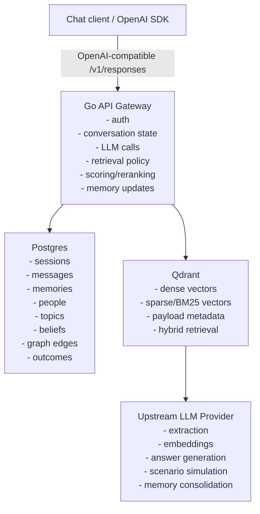

# SecondContext

A context-augmented LLM assistant prototype.

SecondContext is an MVP for building a persistent cognitive context layer around an LLM. Instead of relying only on a stateless chat history, it stores and retrieves structured memories about events, people, topics, beliefs, and interaction outcomes, then uses those memories to improve future responses.

The project explores whether an LLM can behave more like a situated expert when it has access to:

- episodic memory;
- hybrid semantic and lexical retrieval;
- salience scoring;
- person/topic models;
- belief and claim tracking;
- social-role context;
- goal-conditioned scenario generation;
- post-interaction feedback loops.

The first version intentionally avoids custom predictive models such as LightGBM. The MVP uses LLM-based extraction, transparent scoring rules, Qdrant for retrieval, and Postgres for canonical structured state.

## Why this exists

Modern LLMs have broad general knowledge, but they lack the evolving context that humans accumulate from daily experience.

A person makes decisions using more than facts. They use context such as:

- what happened recently;
- what seemed important;
- what changed their beliefs;
- what is useful for current work;
- who is involved;
- how those people usually respond;
- what goal the interaction is trying to achieve.

SecondContext is an experiment in making that context explicit, persistent, inspectable, and useful inside a chat interface.

## MVP hypothesis

> A chat interface augmented with structured memory, hybrid retrieval, and person/topic models can produce more useful answers and interaction strategies than a stateless LLM, especially for recurring work, stakeholder communication, and decision support.

The MVP should prove that the system can:

1. remember relevant prior information;
2. retrieve it based on the current goal;
3. use it to improve an answer;
4. generate better communication strategies;
5. update its internal context after an interaction;
6. expose enough debug information to understand what happened.

## Example use case

User:

> Help me ask Alex to review the infrastructure proposal.

The assistant retrieves context such as:

- Alex is competent on infrastructure topics;
- Alex dislikes vague requests;
- Alex has limited capacity this week;
- previous requests worked better when the scope was narrow;
- Dana is the approver and wants quantified risk.

The assistant can then generate:

- a recommended message;
- alternative strategies;
- likely response scenarios;
- risks;
- fallback options;
- suggested follow-up behavior.

After the interaction, the user can report what happened:

> Alex replied quickly and agreed to review, but asked me to narrow the request to the API section only.

The system then updates its memories and person/topic model so future recommendations improve.

## Architecture



## Core loop

```text
observe -> extract -> store -> retrieve -> reason -> act -> update
```

The system observes user input or manually ingested notes, extracts structured memory, stores it, retrieves relevant context for future tasks, reasons with the LLM, and updates its memory based on outcomes.

## Planned stack

- **Language:** Go
- **API:** OpenAI-compatible `/v1/responses` endpoint
- **Vector database:** Qdrant
- **Structured storage:** Postgres
- **Embeddings:** API-based at first
- **LLM:** OpenAI-compatible provider
- **Deployment:** Docker Compose
- **License:** Apache License 2.0

## Main concepts

### Memory items

A memory item is an observed or inferred piece of context.

Examples:

- “Alex prefers narrow review scopes for infrastructure proposals.”
- “The migration project risk appears higher than originally estimated.”
- “Dana prefers quantified arguments.”
- “The user read an article about vector search tradeoffs.”

Each memory can include:

- raw text;
- summary;
- type;
- source;
- timestamp;
- people;
- topics;
- importance score;
- utility score;
- belief-impact score;
- confidence score;
- expiry or decay behavior.

### Person/topic models

The project models people at topic level, not only globally.

For example, a person may be highly competent and responsive on infrastructure topics, but unavailable or less useful on product strategy topics.

Tracked attributes may include:

- niceness;
- readiness;
- competence;
- capacity;
- confidence;
- evidence count;
- last observed timestamp.

These are uncertain, editable working estimates, not fixed judgments.

### Belief tracking

The system can track claims or assumptions that matter to the user.

Example:

```json
{
  "claim": "The migration project is more risky than originally estimated.",
  "topic": "migration",
  "stance": "supported",
  "confidence": 0.71
}
```

### Goal-conditioned retrieval

The same memory may be relevant or irrelevant depending on the current goal.

Example goals:

- get approval;
- request feedback;
- challenge an assumption;
- prepare for a meeting;
- summarize a topic;
- draft a message;
- decide between options.

### Scenario generation

For communication tasks, the assistant can generate multiple strategies and estimate likely outcomes.

Example strategies:

- direct request;
- deferential request;
- high-context request;
- low-friction scoped request.

The assistant recommends the strategy closest to the user's goal while considering risk and social context.

## Repository structure

Proposed structure:

```text
.
├── cmd/
│   └── api/
├── internal/
│   ├── api/
│   ├── config/
│   ├── db/
│   ├── debug/
│   ├── llm/
│   ├── memory/
│   ├── models/
│   ├── prompts/
│   ├── qdrant/
│   ├── retrieval/
│   └── scoring/
├── migrations/
├── deploy/
│   └── docker-compose.yml
├── docs/
│   ├── PLAN.md
│   └── TODO.md
├── README.md
└── LICENSE
```

## Planned API surface

OpenAI-compatible endpoints:

```text
GET  /v1/models                implemented
POST /v1/responses            implemented
POST /v1/chat/completions     optional
```

Internal/debug endpoints:

```text
POST /memory/ingest          implemented
POST /memory/extract         implemented
GET  /memory                 implemented
DELETE /memory/{id}          implemented
POST /memory/search          implemented
POST /interactions/outcome   implemented
GET  /debug/context          implemented
GET  /debug/beliefs          implemented
GET  /debug/person/:id       implemented
PUT  /debug/person/:id       implemented
```

## Example request

```json
{
  "model": "secondcontext-1",
  "input": "Help me ask Alex to review the infrastructure proposal.",
  "metadata": {
    "goal": "get_review",
    "people": ["Alex"],
    "project": "infrastructure proposal",
    "memory_mode": "social_strategy"
  }
}
```

Stateless comparison request:

```json
{
  "model": "secondcontext-1",
  "input": "Help me ask Alex to review the infrastructure proposal.",
  "disable_memory": true,
  "metadata": {
    "goal": "get_review",
    "people": ["Alex"],
    "memory_mode": "social_strategy"
  }
}
```

## Development status

This project now has a working Stage 13 baseline:

- Postgres-backed schema and repositories;
- `GET /v1/models`;
- non-streaming `POST /v1/responses`;
- an upstream OpenAI-compatible chat client;
- persistence of inbound user messages and assistant replies;
- manual memory ingest, list, and delete endpoints;
- dense embedding generation and Qdrant indexing for memory items;
- LLM-based memory extraction with JSON validation and repair;
- extracted entity persistence in Postgres;
- sparse token indexing alongside dense embeddings in Qdrant;
- hybrid memory retrieval with filters and score breakdowns;
- Go-side salience reranking with configurable weights, recency decay, goal relevance, and redundancy removal;
- prompt augmentation for `/v1/responses` using context packets built from retrieved memories;
- person/topic model extraction and persistence from observed memories;
- safe, topic-scoped person summaries for debug inspection;
- belief extraction and persistence from belief-relevant memories;
- contradiction-aware belief updates with evidence memory references;
- debug endpoint to inspect tracked beliefs by topic;
- prompt augmentation with belief context and uncertainty language;
- structured scenario generation with 3 to 4 strategy options;
- supported interaction goals for communication and decision-support flows;
- server-side recommendation logic that picks a preferred strategy when the model response is incomplete or ambiguous;
- `scenario_plan` metadata persisted alongside assistant responses for later comparison with real outcomes;
- communication-advice mode in `/v1/responses` that returns a recommended approach, concrete draft, alternatives, and fallback steps;
- `POST /interactions/outcome` for reporting what actually happened after an interaction;
- structured outcome analysis that stores actual outcomes, success scores, prediction errors, and extracted graph-edge updates;
- outcome memories linked back to the originating assistant message so future retrieval can learn from real results;
- follow-on person-model and belief updates triggered from stored outcome memories;
- debug endpoints to inspect and manually edit person-topic models;
- `GET /debug/context` for inspecting stored context, rebuilt current context, people models, beliefs, latest-turn updates, and scenario metadata;
- optional stateless-vs-memory comparison in `GET /debug/context`, with a minimal HTML debug view for interactive inspection;
- direct `disable_memory` support on `POST /v1/responses` for stateless runs that still honor explicit request hints;
- debug routes mounted only in development-like environments;
- validated Stage 9 flow covering memory ingest, person inspection, and person-model updates;
- integration-tested Stage 10 flow covering belief extraction, contradiction tracking, debug inspection, and belief-aware prompt augmentation.
- integration-tested Stage 11 flow covering scenario generation, recommended strategy selection, and persisted scenario metadata;
- integration-tested Stage 12 flow covering outcome submission, outcome persistence, graph updates, and memory-driven learning updates;
- integration-tested Stage 13 flow covering debug context inspection, stateless-vs-memory comparison, and direct `disable_memory` behavior on `/v1/responses`.

Not implemented yet:

- streaming responses;
- `POST /v1/chat/completions`.

See:

- [`PLAN.md`](PLAN.md) for the architecture and product plan.
- [`TODO.md`](TODO.md) for the implementation work breakdown.

## Non-goals for the MVP

The MVP does not attempt to:

- train a custom ML model;
- implement LightGBM;
- infer hidden psychological traits with high confidence;
- ingest every possible data source;
- become a full CRM;
- become a general autonomous agent;
- support multi-user enterprise permissions;
- provide production-grade compliance from day one;
- perfectly model people.

The MVP should remain narrow, inspectable, and easy to debug.

## Privacy and safety principles

Because this project may store sensitive information about people, work, and beliefs, the system should be designed with caution.

Principles:

- store evidence, not just conclusions;
- track confidence;
- distinguish facts from interpretations;
- allow editing and deletion;
- avoid irreversible judgments;
- avoid sensitive classifications;
- expire volatile observations;
- keep person models private by default;
- expose debug information to the user.

The assistant should not present uncertain social inferences as facts.

## Running locally

Local development uses Docker Compose for infrastructure and the Go commands in this repository for migrations and the API.

```bash
cp .env.example .env
docker compose up -d postgres qdrant
make migrate-up
go run ./cmd/api
```

Core validation commands:

- `curl http://localhost:8080/healthz`
- `curl http://localhost:8080/v1/models`
- `curl http://localhost:8080/v1/responses -H 'Content-Type: application/json' -d '{"model":"context-agent-1","input":"Help me ask Alex to review the infrastructure proposal."}'`
- `curl http://localhost:8080/v1/responses -H 'Content-Type: application/json' -d '{"model":"context-agent-1","input":"Help me ask Alex to review the infrastructure proposal.","metadata":{"goal":"get_review","people":["Alex"],"memory_mode":"social_strategy"}}'`
- `curl http://localhost:8080/v1/responses -H 'Content-Type: application/json' -d '{"model":"context-agent-1","input":"Help me ask Alex to review the infrastructure proposal.","metadata":{"goal":"get_review","people":["Alex"],"memory_mode":"scenario_generation"}}'`
- `curl http://localhost:8080/v1/responses -H 'Content-Type: application/json' -d '{"model":"context-agent-1","input":"Help me ask Alex to review the infrastructure proposal.","disable_memory":true,"metadata":{"goal":"get_review","people":["Alex"],"memory_mode":"social_strategy"}}'`
- `curl http://localhost:8080/memory/ingest -H 'Content-Type: application/json' -d '{"raw_text":"Alex prefers narrow review scopes.","summary":"Alex prefers narrow review scopes.","type":"person_preference","people":["Alex"],"topics":["infrastructure"],"importance":0.7,"utility":0.8,"belief_impact":0.2,"confidence":0.9}'`
- `curl http://localhost:8080/memory/extract -H 'Content-Type: application/json' -d '{"raw_text":"Alex prefers tightly scoped infrastructure review requests and usually wants the API section only."}'`
- `curl http://localhost:8080/memory/search -H 'Content-Type: application/json' -d '{"query":"api scoped review request","goal":"pick the best review strategy for Alex","user_external_id":"dev-user","people":["Alex"],"confidence_threshold":0.5,"limit":5}'`
- `curl 'http://localhost:8080/memory?user_external_id=dev-user'`
- `curl 'http://localhost:8080/debug/context?session_id=<session-id>&compare=true'`
- `curl 'http://localhost:8080/debug/context?session_id=<session-id>&format=html'`
- `curl 'http://localhost:8080/debug/beliefs?topic_name=migration&user_external_id=dev-user'`
- `curl http://localhost:8080/debug/person/<person-id>`
- `curl -X PUT http://localhost:8080/debug/person/<person-id> -H 'Content-Type: application/json' -d '{"topic_name":"api_review","topic_aliases":["api"],"capacity":0.25,"confidence":0.9}'`

## End-to-end demo

The repo includes a repeatable end-to-end demo runner.

It seeds a compact Alex-and-Dana scenario, compares stateless and memory-augmented responses, generates communication strategies, records an outcome, and then asks a follow-up question to show how the new outcome changes later retrieval.

Run it against an embedded temporary dev server:

```bash
make demo
```

In embedded mode, the demo uses a fresh Qdrant collection per run so old local dev collections do not skew retrieval or trigger stale collection errors.

Or point it at an already running dev API:

```bash
SECOND_CONTEXT_BASE_URL=http://localhost:8080 make demo
```

The runner prints the demo user and session IDs so you can inspect the run through the debug endpoints. More detail is in `docs/demo.md`.

## Evaluation

The repo includes a dataset-driven evaluator that compares stateless and memory-augmented behavior across multiple seeded cases.

It runs baseline and augmented responses, checks retrieval against labeled gold memories, captures strategy and outcome metrics where available, and generates JSON and Markdown reports under `.artifacts/evaluation/`.

Run it with an embedded temporary dev server:

```bash
make eval
```

In embedded mode, the evaluator uses a fresh evaluation Qdrant collection per run so old local dev collections do not skew retrieval metrics.

Or point it at an already running development API:

```bash
SECOND_CONTEXT_BASE_URL=http://localhost:8080 make eval
```

More detail is in `docs/evaluation.md`.

## Configuration

Current environment variables:

```bash
APP_NAME=salience-graph
APP_ENV=development
HTTP_ADDR=:8080
HTTP_SHUTDOWN_TIMEOUT=10s
LOG_LEVEL=info

POSTGRES_ENABLED=true
POSTGRES_HOST=localhost
POSTGRES_PORT=5432
POSTGRES_USER=postgres
POSTGRES_PASSWORD=postgres
POSTGRES_DB=second_context
POSTGRES_SSLMODE=disable

QDRANT_URL=http://localhost:6333
QDRANT_COLLECTION=memory_items

OPENAI_API_KEY=your_api_key_here
OPENAI_BASE_URL=https://api.openai.com/v1
OPENAI_CHAT_MODEL=gpt-4.1-mini
OPENAI_EMBEDDING_MODEL=text-embedding-3-small
```

The public model alias exposed by the API is `context-agent-1`, which currently maps to `OPENAI_CHAT_MODEL` upstream.

## License

Licensed under the Apache License, Version 2.0.

See [`LICENSE`](LICENSE).