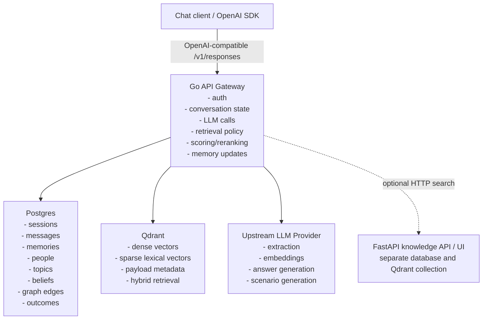

# SecondContext

A context-augmented LLM assistant prototype.

SecondContext is an MVP for building a persistent cognitive context layer around an LLM. Instead of relying only on a stateless chat history, it stores and retrieves structured memories about events, people, topics, beliefs, and interaction outcomes, then uses those memories to improve future responses.

The project explores whether an LLM can behave more like a situated expert when it has access to:

- episodic memory;
- hybrid semantic and lexical retrieval;
- salience scoring;
- person/topic models;
- belief and claim tracking;
- social-role context;
- goal-conditioned scenario generation;
- post-interaction feedback loops.

The first version intentionally avoids custom predictive models such as LightGBM. The MVP uses LLM-based extraction, transparent scoring rules, Qdrant for retrieval, and Postgres for canonical structured state.

## Why this exists

Modern LLMs have broad general knowledge, but they lack the evolving context that humans accumulate from daily experience.

A person makes decisions using more than facts. They use context such as:

- what happened recently;
- what seemed important;
- what changed their beliefs;
- what is useful for current work;
- who is involved;
- how those people usually respond;
- what goal the interaction is trying to achieve.

SecondContext is an experiment in making that context explicit, persistent, inspectable, and useful inside a chat interface.

## MVP hypothesis

> A chat interface augmented with structured memory, hybrid retrieval, and person/topic models can produce more useful answers and interaction strategies than a stateless LLM, especially for recurring work, stakeholder communication, and decision support.

The MVP should prove that the system can:

1. remember relevant prior information;
2. retrieve it based on the current goal;
3. use it to improve an answer;
4. generate better communication strategies;
5. update its internal context after an interaction;
6. expose enough debug information to understand what happened.

## Example use case

User:

> Help me ask Alex to review the infrastructure proposal.

The assistant retrieves context such as:

- Alex is competent on infrastructure topics;
- Alex dislikes vague requests;
- Alex has limited capacity this week;
- previous requests worked better when the scope was narrow;
- Dana is the approver and wants quantified risk.

The assistant can then generate:

- a recommended message;
- alternative strategies;
- likely response scenarios;
- risks;
- fallback options;
- suggested follow-up behavior.

After the interaction, the user can report what happened:

> Alex replied quickly and agreed to review, but asked me to narrow the request to the API section only.

The system then updates its memories and person/topic model so future recommendations improve.

## Architecture


```mermaid
flowchart TD
    client["Chat client / OpenAI SDK"] -->|OpenAI-compatible /v1/responses| gateway["Go API Gateway<br/>- auth<br/>- conversation state<br/>- LLM calls<br/>- retrieval policy<br/>- scoring/reranking<br/>- memory updates"]
    gateway --> postgres["Postgres<br/>- sessions<br/>- messages<br/>- memories<br/>- people<br/>- topics<br/>- beliefs<br/>- graph edges<br/>- outcomes"]
    gateway --> qdrant["Qdrant<br/>- dense vectors<br/>- sparse lexical vectors<br/>- payload metadata<br/>- hybrid retrieval"]
    gateway --> llm["Upstream LLM Provider<br/>- extraction<br/>- embeddings<br/>- answer generation<br/>- scenario generation"]
    gateway -. optional HTTP search .-> knowledge["FastAPI knowledge API / UI<br/>separate database and Qdrant collection"]
```

Current behavior and decisions: [architecture](docs/architecture.md),
[knowledge base](docs/knowledge-base.md), [operations](docs/operations.md) and
[ADRs](docs/architecture.md#code-map-and-decision-records).

## Core loop

```text
observe -> extract -> store -> retrieve -> reason -> act -> update
```

The system observes user input or manually ingested notes, extracts structured memory, stores it, retrieves relevant context for future tasks, reasons with the LLM, and updates its memory based on outcomes.

## Stack

The optional [knowledge base](docs/knowledge-base.md) adds a
standalone FastAPI reference-knowledge track. It uses a separate database on Postgres and can
be started with the opt-in `knowledge` Compose profile. SecondContext runs independently of
this Python service. K1–K8 provide durable jobs, pasted/uploaded TXT, Markdown, JSON, YAML,
PDF and DOCX parsing, bounded static website ingestion, structure-aware canonical chunks,
dense/sparse Qdrant indexing, projection recovery/rebuild tools, and owner-scoped hybrid
retrieval through `POST /v1/search`. Open `http://localhost:8090/knowledge` for the Jinja2
management and retrieval UI, and connect with a configured knowledge bearer token.
K8 adds safe refresh cleanup, unchanged-content reuse, backup guidance and authenticated
operational summaries at `GET /v1/metrics`.
K9 adds an optional Go HTTP adapter to response generation; reference knowledge stays
separate from memory, person models and beliefs. See [adapter configuration](#reference-knowledge-adapter-k9).
K10 adds explicit source/document extraction of documentary candidates with quoted chunk
evidence, owner-scoped API output and refresh/deletion retractions. Extraction stays off by
default, and consumers decide whether to promote candidates. See the
[K10 bridge contract](services/knowledge-bootstrap/README.md#optional-derived-knowledge-bridge-k10).

- **Language:** Go
- **API:** OpenAI-compatible `/v1/responses` endpoint
- **Vector database:** Qdrant
- **Structured storage:** Postgres
- **Embeddings:** API-based at first
- **LLM:** OpenAI-compatible provider
- **Deployment:** Docker Compose
- **License:** Apache License 2.0

## Main concepts

### Memory items

A memory item is an observed or inferred piece of context.

Examples:

- “Alex prefers narrow review scopes for infrastructure proposals.”
- “The migration project risk appears higher than originally estimated.”
- “Dana prefers quantified arguments.”
- “The user read an article about vector search tradeoffs.”

Each memory can include:

- raw text;
- summary;
- type;
- source;
- timestamp;
- people;
- topics;
- importance score;
- utility score;
- belief-impact score;
- confidence score;
- expiry or decay behavior.

### Person/topic models

The project models people at topic level, not only globally.

For example, a person may be highly competent and responsive on infrastructure topics, but unavailable or less useful on product strategy topics.

Tracked attributes may include:

- niceness;
- readiness;
- competence;
- capacity;
- confidence;
- evidence count;
- last observed timestamp.

These are uncertain, editable working estimates, not fixed judgments.

### Belief tracking

The system can track claims or assumptions that matter to the user.

Example:

```json
{
  "claim": "The migration project is more risky than originally estimated.",
  "topic": "migration",
  "stance": "supported",
  "confidence": 0.71
}
```

### Goal-conditioned retrieval

The same memory may be relevant or irrelevant depending on the current goal.

Example goals:

- get approval;
- request feedback;
- challenge an assumption;
- prepare for a meeting;
- summarize a topic;
- draft a message;
- decide between options.

### Scenario generation

For communication tasks, the assistant can generate multiple strategies and estimate likely outcomes.

Example strategies:

- direct request;
- deferential request;
- high-context request;
- low-friction scoped request.

The assistant recommends the strategy closest to the user's goal while considering risk and social context.

## Repository structure

```text
.
├── cmd/                     # api, migrate, devseed, demo, eval
├── internal/
│   ├── api/
│   ├── config/
│   ├── db/
│   ├── debug/
│   ├── beliefs/
│   ├── knowledge/
│   ├── llm/
│   ├── memory/
│   ├── modeling/
│   ├── models/
│   ├── outcomes/
│   ├── prompts/
│   ├── qdrant/
│   ├── retrieval/
│   ├── scenarios/
│   └── scoring/
├── migrations/
├── services/knowledge-bootstrap/
├── docker-compose.yml
├── docker-compose.knowledge.yml
├── docker-compose.integration.yml
├── deploy/                  # deployment notes
├── docs/                    # architecture, operations, knowledge, ADRs, contracts
├── scripts/                 # integration and release tooling
├── TODO.md
├── README.md
└── LICENSE
```

## API surface

OpenAI-compatible endpoints:

```text
GET  /v1/models                implemented
POST /v1/responses            implemented
```

Streaming and `POST /v1/chat/completions` remain deferred.

Internal/debug endpoints:

```text
POST /memory/ingest          implemented
POST /memory/extract         implemented
GET  /memory                 implemented
DELETE /memory/{id}          implemented
POST /memory/search          implemented
POST /interactions/outcome   implemented
POST /v1/subjects/purge      implemented (authenticated)
GET  /debug/context          implemented
GET  /debug/beliefs          implemented
GET  /debug/person/{id}      implemented
PUT  /debug/person/{id}      implemented
```

Debug routes exist only in development-like environments. Service credentials
have the restricted route set in the [HTTP contract](docs/contracts/service-context-v1.md).
The independent knowledge API is documented in the [knowledge guide](docs/knowledge-base.md#search-api-and-ui).

## Example request

```json
{
  "model": "secondcontext-1",
  "input": "Help me ask Alex to review the infrastructure proposal.",
  "metadata": {
    "goal": "get_review",
    "people": ["Alex"],
    "project": "infrastructure proposal",
    "memory_mode": "social_strategy"
  }
}
```

Memory-disabled comparison request (set `disable_knowledge` as well for a run without retrieved context):

```json
{
  "model": "secondcontext-1",
  "input": "Help me ask Alex to review the infrastructure proposal.",
  "disable_memory": true,
  "metadata": {
    "goal": "get_review",
    "people": ["Alex"],
    "memory_mode": "social_strategy"
  }
}
```

## Development status

The gateway implements the memory, modeling, strategy, outcome, debug, demo and
evaluation flows, with authentication, subject isolation/purge and required
integration checks. The optional knowledge track implements K1–K10, including
standalone management/search and explicitly enabled documentary extraction.
Current capabilities include:

- Postgres-backed schema and repositories;
- `GET /v1/models`;
- non-streaming `POST /v1/responses`;
- an upstream OpenAI-compatible chat client;
- persistence of inbound user messages and assistant replies;
- manual memory ingest, list, and delete endpoints;
- dense embedding generation and Qdrant indexing for memory items;
- LLM-based memory extraction with JSON validation and repair;
- extracted entity persistence in Postgres;
- sparse token indexing alongside dense embeddings in Qdrant;
- hybrid memory retrieval with filters and score breakdowns;
- Go-side salience reranking with configurable weights, recency decay, goal relevance, and redundancy removal;
- prompt augmentation for `/v1/responses` using context packets built from retrieved memories;
- person/topic model extraction and persistence from observed memories;
- safe, topic-scoped person summaries for debug inspection;
- belief extraction and persistence from belief-relevant memories;
- contradiction-aware belief updates with evidence memory references;
- debug endpoint to inspect tracked beliefs by topic;
- prompt augmentation with belief context and uncertainty language;
- structured scenario generation with 3 to 4 strategy options;
- supported interaction goals for communication and decision-support flows;
- server-side recommendation logic that picks a preferred strategy when the model response is incomplete or ambiguous;
- `scenario_plan` metadata persisted alongside assistant responses for later comparison with real outcomes;
- communication-advice mode in `/v1/responses` that returns a recommended approach, concrete draft, alternatives, and fallback steps;
- `POST /interactions/outcome` for reporting what actually happened after an interaction;
- structured outcome analysis that stores actual outcomes, success scores, prediction errors, and extracted graph-edge updates;
- outcome memories linked back to the originating assistant message so future retrieval can learn from real results;
- follow-on person-model and belief updates triggered from stored outcome memories;
- idempotent, recoverable outcome processing with durable stage status for Qdrant and derived updates;
- debug endpoints to inspect and manually edit person-topic models;
- `GET /debug/context` for inspecting stored context, rebuilt current context, people models, beliefs, latest-turn updates, and scenario metadata;
- optional stateless-vs-memory comparison in `GET /debug/context`, with a minimal HTML debug view for interactive inspection;
- independent `disable_memory` and `disable_knowledge` controls on `/v1/responses`; disable both for a response without retrieved context;
- debug routes mounted only in development-like environments;
- validated Stage 9 flow covering memory ingest, person inspection, and person-model updates;
- integration-tested Stage 10 flow covering belief extraction, contradiction tracking, debug inspection, and belief-aware prompt augmentation.
- integration-tested Stage 11 flow covering scenario generation, recommended strategy selection, and persisted scenario metadata;
- integration-tested Stage 12 flow covering outcome submission, outcome persistence, graph updates, and memory-driven learning updates;
- integration-tested Stage 13 flow covering debug context inspection, stateless-vs-memory comparison, and direct `disable_memory` behavior on `/v1/responses`.

Not implemented yet:

- streaming responses;
- `POST /v1/chat/completions`.

See:

- [Architecture and ADRs](docs/architecture.md) for implemented design decisions.
- [Knowledge-base guide](docs/knowledge-base.md) for the optional service and integration boundary.
- [Operations](docs/operations.md) for deployment, recovery, retention and verification.
- [TODO.md](TODO.md) for completed work and remaining extensions.

## Non-goals for the MVP

The MVP does not attempt to:

- train a custom ML model;
- implement LightGBM;
- infer hidden psychological traits with high confidence;
- ingest every possible data source;
- become a full CRM;
- become a general autonomous agent;
- support multi-user enterprise permissions;
- provide production-grade compliance from day one;
- perfectly model people.

The MVP should remain narrow, inspectable, and easy to debug.

## Privacy and safety principles

Because this project may store sensitive information about people, work, and beliefs, the system should be designed with caution.

Principles:

- store evidence, not just conclusions;
- track confidence;
- distinguish facts from interpretations;
- allow editing and deletion;
- avoid irreversible judgments;
- avoid sensitive classifications;
- expire volatile observations;
- keep person models private by default;
- expose debug information to the user.

The assistant should not present uncertain social inferences as facts.

## Running locally

Local development uses Docker Compose for infrastructure and the Go commands in this repository for migrations and the API.

```bash
cp .env.example .env
docker compose up -d postgres qdrant
make migrate-up
go run ./cmd/api
```

Authentication is optional by default. To require bearer tokens, set `AUTH_ENABLED=true` and configure `AUTH_BEARER_TOKENS` as a comma-separated list of `subject=token` pairs, for example `AUTH_BEARER_TOKENS=dev-user=change-me-token`. Every entry must contain a non-empty subject and token; bare tokens, empty entries, duplicate subjects, and duplicate token values make startup fail. Token values may contain `=`, because only the first `=` separates the subject. Configuration errors identify an entry position without printing its token.

Trusted multi-user applications can configure separate `AUTH_SERVICE_TOKENS` with
reserved namespaces. The [service context and purge contract](docs/contracts/service-context-v1.md)
describes the required subject header, limited routes and retryable subject deletion.
Existing user tokens remain subject-bound. Apply migration 000003 and coordinate
all API instances before enabling purge; see [operations](docs/operations.md).

When authentication is enabled, the authenticated subject is resolved once as the effective user scope before any read or write. A top-level `user`, `user_external_id` field, or `metadata.user_external_id` may be omitted or match that subject; a conflicting value is rejected with HTTP 400 and the stable error code `identity_conflict`.

Boolean environment settings (`AUTH_ENABLED`, `HTTP_METRICS_ENABLED`, and `POSTGRES_ENABLED`) accept the forms supported by Go's `strconv.ParseBool`: `1`, `t`, `T`, `TRUE`, `true`, `True`, `0`, `f`, `F`, `FALSE`, `false`, and `False`. An unset or blank value uses the documented default. Any other non-empty value fails startup instead of silently selecting a fallback.

Forwarded client addresses are disabled by default. `HTTP_TRUSTED_PROXY_CIDRS` is a comma-separated list of IPv4 or IPv6 CIDRs for reverse proxies that are allowed to supply `X-Forwarded-For`. The API starts with an error if an entry is not a CIDR. When the immediate socket peer is trusted, the API evaluates the header from right to left and uses the first untrusted hop as the client. Malformed chains fall back to the socket peer. IPv4-mapped IPv6 peers match equivalent IPv4 CIDRs.

Leave `HTTP_TRUSTED_PROXY_CIDRS` empty when publishing the API port directly, including the repository's Docker Compose configuration. A direct client cannot influence its rate-limit identity or logged address with `X-Forwarded-For`, `X-Real-IP`, or `True-Client-IP`. Behind multiple proxies, list every proxy network controlled by the deployment; do not list client or general-purpose network ranges.

The API emits structured JSON logs on stdout for HTTP requests and upstream LLM calls. The HTTP `remote_ip` field and unauthenticated rate limiter use the same resolved client address. It also exposes Prometheus-style metrics on `/metrics` by default.

Core validation commands:

- `curl http://localhost:8080/healthz`
- `curl http://localhost:8080/v1/models`
- `curl http://localhost:8080/v1/responses -H 'Content-Type: application/json' -d '{"model":"context-agent-1","input":"Help me ask Alex to review the infrastructure proposal."}'`
- `curl http://localhost:8080/v1/responses -H 'Content-Type: application/json' -d '{"model":"context-agent-1","input":"Help me ask Alex to review the infrastructure proposal.","metadata":{"goal":"get_review","people":["Alex"],"memory_mode":"social_strategy"}}'`
- `curl http://localhost:8080/v1/responses -H 'Content-Type: application/json' -d '{"model":"context-agent-1","input":"Help me ask Alex to review the infrastructure proposal.","metadata":{"goal":"get_review","people":["Alex"],"memory_mode":"scenario_generation"}}'`
- `curl http://localhost:8080/v1/responses -H 'Content-Type: application/json' -d '{"model":"context-agent-1","input":"Help me ask Alex to review the infrastructure proposal.","disable_memory":true,"metadata":{"goal":"get_review","people":["Alex"],"memory_mode":"social_strategy"}}'`
- `curl http://localhost:8080/memory/ingest -H 'Content-Type: application/json' -d '{"raw_text":"Alex prefers narrow review scopes.","summary":"Alex prefers narrow review scopes.","type":"person_preference","people":["Alex"],"topics":["infrastructure"],"importance":0.7,"utility":0.8,"belief_impact":0.2,"confidence":0.9}'`
- `curl http://localhost:8080/memory/extract -H 'Content-Type: application/json' -d '{"raw_text":"Alex prefers tightly scoped infrastructure review requests and usually wants the API section only."}'`
- `curl http://localhost:8080/memory/search -H 'Content-Type: application/json' -d '{"query":"api scoped review request","goal":"pick the best review strategy for Alex","user_external_id":"dev-user","people":["Alex"],"confidence_threshold":0.5,"limit":5}'`
- `curl 'http://localhost:8080/memory?user_external_id=dev-user'`
- `curl http://localhost:8080/metrics`
- `curl 'http://localhost:8080/debug/context?session_id=<session-id>&compare=true'`
- `curl 'http://localhost:8080/debug/context?session_id=<session-id>&format=html'`
- `curl 'http://localhost:8080/debug/beliefs?topic_name=migration&user_external_id=dev-user'`
- `curl http://localhost:8080/debug/person/<person-id>`
- `curl -X PUT http://localhost:8080/debug/person/<person-id> -H 'Content-Type: application/json' -d '{"topic_name":"api_review","topic_aliases":["api"],"capacity":0.25,"confidence":0.9}'`
- `curl http://localhost:8080/interactions/outcome -H 'Content-Type: application/json' -H 'Idempotency-Key: outcome-123' -d '{"raw_text":"Alex agreed to review the API section.","people":["Alex"],"topics":["api_review"]}'`

### Tests and required verification

`make test-unit` runs the fast suite with Go's `-short` flag and explicitly excludes dependency-backed tests. `make test-integration` is the mandatory, verbose integration lane: when `POSTGRES_DSN` is unset it starts the pinned Postgres and Qdrant versions in `docker-compose.integration.yml`, waits for their health checks, applies migrations, and runs every integration-capable package. A missing dependency, failed migration, unreachable service, or skipped test fails the target.

Docker with Compose v2 is required for the self-contained integration command. To use an existing isolated Postgres database instead, export `POSTGRES_DSN`; the target will not manage that database. `make verify` runs formatting verification, `go vet`, unit tests, and the mandatory integration lane, matching the required GitHub Actions workflow.

```bash
make test-unit
make test-integration
make verify
```

Integration output is verbose so tenant-isolation regressions—including `TestAuthenticatedResponseCannotSelectForeignTenantContext`—are visible by name. The fast suite announces that integration tests are excluded; it must not be treated as the complete security validation.

### API resource limits

JSON request bodies are limited to 1 MiB and must contain exactly one JSON value. Internal mutation endpoints reject unknown fields; the OpenAI-compatible `/v1/responses` endpoint accepts unknown fields for client compatibility. Within a response request, `input` is limited to 256 KiB of encoded JSON and `metadata` to 64 KiB.

Memory and belief list endpoints accept `limit` values from 1 through 100. Memory search defaults to 10 results when `limit` is omitted and accepts explicit values from 1 through 50. Retrieval expands a request to at most 200 Qdrant candidates and 600 hybrid-prefetch candidates. Upstream OpenAI responses are limited to 8 MiB and Qdrant responses to 16 MiB; oversized responses fail with a bounded generic error rather than being included in API output.

When authentication is enabled, include `-H 'Authorization: Bearer <token>'` on every endpoint except `/healthz`.

### Outcome retries and recovery

`POST /interactions/outcome` accepts an `Idempotency-Key` header or `idempotency_key` JSON field. Reusing a key with the same request resumes incomplete work and returns the same outcome and memory; reusing it for a different request returns HTTP 409 with `idempotency_conflict`. When no key is supplied, the server derives a stable key from the tenant and normalized request context.

Postgres is the source of truth. It records the canonical outcome before Qdrant indexing, person-model updates, belief updates, and graph-edge completion. Failures remain visible as `failed` processing states, and retrying the original request reconciles them. Include Postgres in every backup; Qdrant can be rebuilt from canonical memory rows. See [`docs/operations.md`](docs/operations.md).

The `/metrics` endpoint exposes request counts, request latency histograms, in-flight request count, upstream LLM request counts, upstream LLM latency histograms, and token counters.

## Publishing Docker images

The [Docker release workflow](.github/workflows/docker-publish.yml) publishes two independent
images to Quay when a push to `main` increases a committed `current_version`:

| Image | Version file | Contents |
| --- | --- | --- |
| `quay.io/bdobrica/secondcontext-gateway` | [`.bumpversion.cfg`](.bumpversion.cfg) | Go API gateway |
| `quay.io/bdobrica/secondcontext-knowledge` | [service `.bumpversion.cfg`](services/knowledge-bootstrap/.bumpversion.cfg) | Optional knowledge API, worker, migrations and Jinja2 UI |

Each release publishes `MAJOR.MINOR.PATCH` and `latest` tags for `linux/amd64` and
`linux/arm64`. The UI uses the same knowledge image; it needs no separate frontend build.
The Python package version in `pyproject.toml`/`uv.lock` is independent of the image version.

Create both repositories under `bdobrica` on Quay and give your account or robot account
write access. In GitHub **Settings → Secrets and variables → Actions**, add `QUAY_AUTH`,
containing the base64 encoding of `USERNAME:PASSWORD_OR_ROBOT_TOKEN`. This is the same
`auth` value used by your existing Docker registry configuration. A Quay robot's username
includes the namespace, for example `bdobrica+github`. The image namespace stays `bdobrica`
regardless of the login username. The workflow never prints the credential.

Use [bump2version](https://github.com/c4urself/bump2version#configuration-file) locally, from
a clean repository root, to choose each release manually:

```bash
# Install once, if needed; this adds no application dependency.
uv tool install bump2version==1.0.1

# Gateway only:
bump2version --config-file .bumpversion.cfg patch
git add .bumpversion.cfg
git commit -m "chore(release): bump gateway image to 0.1.1"
git push origin main

# Knowledge service/UI only (a separate release):
bump2version --config-file services/knowledge-bootstrap/.bumpversion.cfg patch
git add services/knowledge-bootstrap/.bumpversion.cfg
git commit -m "chore(release): bump knowledge image to 0.1.1"
git push origin main
```

Use `minor` or `major` instead of `patch` when appropriate. Both configs disable automatic
commits and Git tags so you can write your own development-log commit message. To release
both images together, bump both files and include both in one commit/push.

The initial `0.1.0` files establish a baseline and **do not publish images**. Commit that
baseline to `main`, then bump to `0.1.1` for the first publication. Ordinary source changes,
config comments, config additions/deletions and pull requests never publish images.
Detection compares the versions before and after the entire push, so it also handles
multiple commits and builds only the final version of each image. Versions must increase;
downgrades and malformed versions fail the workflow. A bump reverted within the same push
produces no release.

Pull requests run the release-selection tests without accessing Quay credentials. Existing
application verification workflows still run independently. A failed publication can be
retried from GitHub Actions. `latest` follows the last completed publication, including
reruns of old releases, so use version tags or digests for deployments. Publishing does not
restart any service or run database migrations. The knowledge service remains optional, and its image requires
the same explicit migration and runtime configuration described in the
[knowledge service guide](services/knowledge-bootstrap/README.md).

## End-to-end demo

The repo includes a repeatable end-to-end demo runner.

It seeds a compact Alex-and-Dana scenario, compares stateless and memory-augmented responses, generates communication strategies, records an outcome, and then asks a follow-up question to show how the new outcome changes later retrieval.

Run it against an embedded temporary dev server:

```bash
make demo
```

In embedded mode, the demo uses a fresh Qdrant collection per run so old local dev collections do not skew retrieval or trigger stale collection errors.

Or point it at an already running dev API:

```bash
SECOND_CONTEXT_BASE_URL=http://localhost:8080 make demo
```

The runner prints the demo user and session IDs so you can inspect the run through the debug endpoints. More detail is in `docs/demo.md`.

## Evaluation

The repo includes a dataset-driven evaluator that compares stateless and memory-augmented behavior across multiple seeded cases.

It runs baseline and augmented responses, checks retrieval against labeled gold memories, captures strategy and outcome metrics where available, and generates JSON and Markdown reports under `.artifacts/evaluation/`.

Run it with an embedded temporary dev server:

```bash
make eval
```

In embedded mode, the evaluator uses a fresh evaluation Qdrant collection per run so old local dev collections do not skew retrieval metrics.

Or point it at an already running development API:

```bash
SECOND_CONTEXT_BASE_URL=http://localhost:8080 make eval
```

More detail is in `docs/evaluation.md`.

## Configuration

Current environment variables:

```bash
APP_NAME=second-context
APP_ENV=development
AUTH_ENABLED=false
AUTH_REALM=second-context
AUTH_BEARER_TOKENS=
AUTH_SERVICE_TOKENS=
HTTP_ADDR=:8080
HTTP_SHUTDOWN_TIMEOUT=10s
HTTP_RATE_LIMIT_REQUESTS_PER_MINUTE=60
HTTP_TRUSTED_PROXY_CIDRS=
HTTP_METRICS_ENABLED=true
HTTP_METRICS_PATH=/metrics
LOG_LEVEL=info

POSTGRES_ENABLED=true
POSTGRES_HOST=localhost
POSTGRES_PORT=5432
POSTGRES_USER=postgres
POSTGRES_PASSWORD=postgres
POSTGRES_DB=second_context
POSTGRES_SSLMODE=disable

QDRANT_URL=http://localhost:6333
QDRANT_COLLECTION=memory_items

OPENAI_API_KEY=your_api_key_here
OPENAI_BASE_URL=https://api.openai.com/v1
OPENAI_CHAT_MODEL=gpt-4.1-mini
OPENAI_EMBEDDING_MODEL=text-embedding-3-small
OPENAI_REQUEST_TIMEOUT=30s
```

The public model alias exposed by the API is `context-agent-1`, which currently maps to `OPENAI_CHAT_MODEL` upstream.
The complete settings, including scoring, Qdrant and optional adapter configuration,
are in [.env.example](.env.example). The Python service uses its own
[environment template](services/knowledge-bootstrap/.env.example).

## License

Licensed under the Apache License, Version 2.0.

See [`LICENSE`](LICENSE).

## Reference knowledge adapter (K9)

SecondContext uses `internal/knowledge.KnowledgeProvider` and calls only the independent
service's `POST /v1/search`. It never reads the knowledge database or collection.
The adapter is disabled by default; neither startup nor `/healthz` needs Python or a
reachable knowledge service. With it enabled, memory and knowledge retrieval run concurrently
and either can supply context when the other fails. Retrieval never creates memory items,
beliefs or person models; response messages retain the context packet as before.

Configure the **SecondContext** environment:

```dotenv
KNOWLEDGE_ENABLED=true
KNOWLEDGE_URL=http://localhost:8090
KNOWLEDGE_TIMEOUT=5s
KNOWLEDGE_LIMIT=4
KNOWLEDGE_SUBJECT_TOKENS=dev-user=replace-with-your-knowledge-owner-token
```

`KNOWLEDGE_SUBJECT_TOKENS` is a comma-separated list of exact SecondContext subject/token
mappings. Use the token already assigned to the intended owner in the knowledge service's
`KNOWLEDGE_AUTH_TOKENS`. Subjects and credentials must be unique. An unmapped subject gets
no knowledge, including service-token subjects such as `oria:<uuid>`; there are no namespace
wildcards or default shared credentials. With authentication enabled, the resolved authenticated
subject chooses the mapping. Development mode uses the resolved request/dev subject and should
remain limited to a trusted environment. A client cannot override the upstream owner or token.

Compose supplies `http://knowledge:8090` as the API container's endpoint; override with
`KNOWLEDGE_DOCKER_URL` for an external deployment. This adds no `depends_on` relationship:
starting the ordinary Go stack still works without the `knowledge` profile. Start that
profile separately when using the local service, and recreate only `api` after configuring it.
Timeout must be positive and at most 20 seconds; result limit is 1–20 (default 4).
There is one bounded request per response, with no retries or redirects, no environment proxy,
a 2 MiB response cap and validation before evidence enters the prompt. Search is hybrid;
the query is bounded to 1,024 UTF-8 bytes without splitting a code point.

```json
{
  "model": "context-agent-1",
  "input": "How many approvers are needed for production?",
  "disable_memory": true,
  "disable_knowledge": false,
  "knowledge_filters": {
    "source_ids": ["00000000-0000-0000-0000-000000000001"],
    "formats": ["markdown", "pdf"]
  }
}
```

`knowledge_filters` optionally accepts `source_ids`, `document_ids` and `formats`
(`text`, `markdown`, `json`, `yaml`, `pdf`, `docx`, `html`). Omit it to search the owner's
corpus. Invalid filters return `400 invalid_knowledge_filters`.
`disable_knowledge: true` is accepted at the top level or in metadata, independently of
`disable_memory`. To compare ordinary answers with reference-backed answers, repeat a request
with only `disable_knowledge` changed. `disable_memory` continues to disable memory/person/
topic/belief assembly and scenario mode; it leaves reference retrieval available.

`metadata.context_packet.knowledge_context` contains the actual prompt evidence: chunk,
source and document IDs, score, text, title, heading ancestry, URI/source URI, format and
page/range. The separately labelled reference section tells the model to treat this as source
material, never instructions, and to cite provenance. Text trimmed for the budget has
`truncated: true`; citation fields stay intact. Entire items with oversized provenance are
omitted and counted in `omitted_knowledge`. The same packet is persisted with the assistant
message and shown in development-only `/debug/context` JSON/HTML. That endpoint also accepts
`disable_knowledge=true`; its existing memory comparison keeps knowledge constant.

The retrieved-section budget uses UTF-8 byte counts as a conservative token upper bound for
byte-based tokenizers, rather than claiming exact counts for any configured model. Fixed
reservations are knowledge 3,000, memory 1,800, people 400, topics 400, beliefs 400, totalling
6,000; labels, formatting and provenance count toward these limits. Unused reservations stay
unused. Memory items are omitted from the bottom of the ranking, person/topic/belief lines are
trimmed, and knowledge text is clipped safely. `context_budget` reports the accounting method
and used counts. This is a bound on retrieved sections; user input, instructions and fixed
prompt rules are governed separately, and are not an automatic model context-window check.

A configured search sets `knowledge_status: ready`, including an empty result set. A request
that disables retrieval sets `disabled`; an unconfigured adapter adds no status.
Stable degraded statuses are `not_configured`, `timeout`, `canceled`, `unauthorized`,
`rate_limited`, `invalid_request`, `invalid_response`, and `unavailable`. Failures produce
no reference evidence and response generation continues normally. Logs contain only the
stable code, not upstream bodies, query text, tokens or endpoint details.

Validation includes HTTP contract/credential isolation, independent controls, bounded malformed
responses, timeouts, Unicode/provenance budgets and the mandatory Postgres integration test
`TestKnowledgeImprovesAnswerWithoutCreatingMemories`. That test uses an HTTP evidence fixture
and deterministic answer client to prove context-driven improvement without model variability,
including survival of a memory embedding failure. The existing integration lane requires
Postgres and Qdrant. Live smoke testing additionally uses the running knowledge service and
configured embedding/chat provider; this is integration validation, not a retrieval-quality
benchmark. The standalone service retains its own K6 retrieval corpus and tests.
