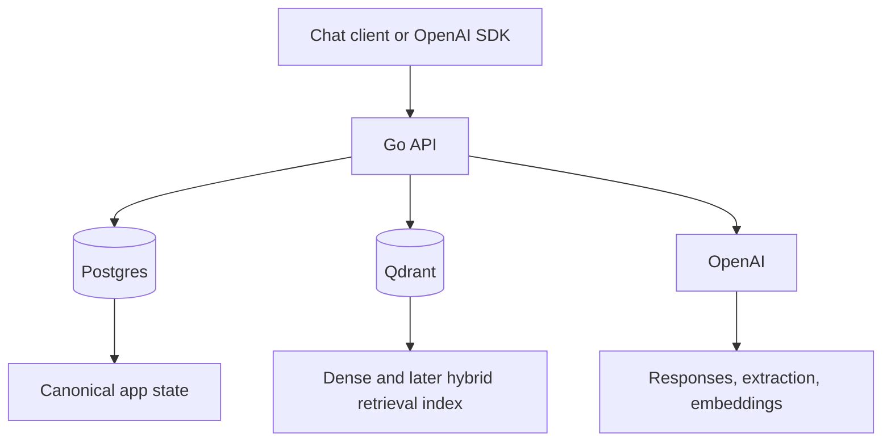

# Architecture

## MVP summary

SecondContext is an OpenAI-compatible Go API that adds persistent context around an upstream LLM. Postgres remains the source of truth for messages, memory items, people, topics, beliefs, and interaction outcomes. Qdrant is the retrieval index. The API retrieves and reranks relevant context before building prompts, and later updates memory from outcomes.

## Initial decisions

- LLM provider: OpenAI
- Embedding model: `text-embedding-3-small`
- API framework: `chi`
- Migration tool: `golang-migrate`
- Core architecture: Go API + Postgres + Qdrant

## Initial diagram

## Outcome consistency

Postgres is authoritative for an interaction outcome and its recovery state. Processing moves from analysis to a canonical `pending` outcome, then through memory creation, Qdrant indexing, person-model updates, belief updates, graph edges, and finally `completed`.

The tenant-scoped idempotency key uniquely identifies the canonical outcome. Its memory uses the outcome ID as a stable key, Qdrant uses the memory ID as the point ID, and graph edges use an outcome-scoped identity. Each retry reads durable stage status, skips completed stages, and resumes pending or failed work. A key reused with a different request hash is rejected.

Postgres writes that reserve the canonical outcome run in a transaction through a transaction-capable repository interface. Cross-system work cannot join that transaction, so its status and last error are persisted instead of being hidden or compensated destructively.

## Initial module responsibilities

- `cmd/api`: process entrypoint and lifecycle.
- `internal/api`: HTTP routing, middleware, and health endpoints.
- `internal/config`: environment-driven application configuration.
- `internal/db`: Postgres connection setup.
- `internal/llm`: upstream model clients.
- `internal/memory`: memory ingestion and update flows.
- `internal/retrieval`: retrieval orchestration.
- `internal/scoring`: salience and reranking logic.
- `internal/qdrant`: vector index integration.
- `internal/prompts`: prompt templates and builders.
- `internal/debug`: inspectability endpoints and tooling.
