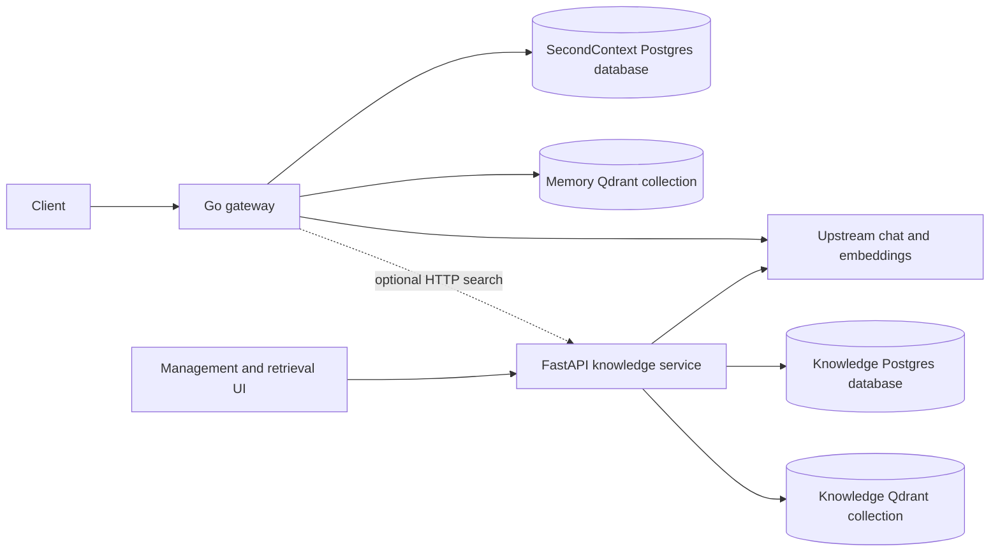

# Architecture

SecondContext is a Go gateway that adds persistent context to an upstream
OpenAI-compatible model. It supports non-streaming `/v1/responses`, memory
ingestion/search, topic-specific person models, belief tracking, communication
strategies and outcome feedback. The optional knowledge base adds documentary
evidence through HTTP and runs independently.

## Services and storage

```mermaid
flowchart LR
    Client[Client] --> Gateway[Go gateway]
    Gateway --> MemoryDB[(SecondContext Postgres database)]
    Gateway --> MemoryIndex[(Memory Qdrant collection)]
    Gateway --> Model[Upstream chat and embeddings]
    Gateway -. optional HTTP search .-> Knowledge[FastAPI knowledge service]
    Browser[Management and retrieval UI] --> Knowledge
    Knowledge --> KnowledgeDB[(Knowledge Postgres database)]
    Knowledge --> KnowledgeIndex[(Knowledge Qdrant collection)]
    Knowledge --> Model
```

Both applications may share Postgres and Qdrant deployments, but use separate
canonical databases and collections. Neither application reads the other's
tables or index. Ordinary Go startup needs no Python service. Knowledge ingestion,
management and retrieval need no SecondContext gateway.

The gateway uses `chi`, `pgx`, `golang-migrate` and OpenAI-compatible HTTP clients.
The knowledge service uses Python 3.13+, FastAPI, SQLAlchemy/psycopg, Alembic and
Jinja2 with bundled JavaScript/CSS. Configuration and migrations are independent.
The default embedding model is `text-embedding-3-small` with 1,536 dimensions;
runtime settings select providers/models rather than fixing a single vendor.

## Memory and cognitive context

Postgres owns users, sessions, messages, memory items/entities, people, topics,
person/topic models, beliefs, graph edges, outcomes and subject-deletion fences.
Manual ingestion accepts scores and people/topics; extraction uses validated LLM
JSON with repair before persistence. Memory creation also drives person-model
and belief observations with evidence memory IDs.

Memory search combines dense and hashed lexical vectors in Qdrant, hydrates
canonical rows and applies Go salience ranking. The lexical baseline uses
lowercase ASCII words, FNV-32a hashes and term counts; it is separate from the
knowledge service's Unicode/log-TF/IDF recipe. Filters cover owner, memory type,
people, topics, confidence and expiry. Expired memories are excluded by default.

Salience combines retrieval (0.35), recency (0.15), importance (0.15), utility
(0.15), goal relevance (0.10), belief impact (0.05) and confidence (0.05).
Positive weights are normalized; recency defaults to a 30-day half-life.
Summary word-set Jaccard similarity suppresses redundancy at the default 0.82
threshold. These are ranking heuristics, not calibrated probabilities.

Person estimates are topic-specific niceness, readiness, competence and capacity
with confidence, evidence count and observation time. Prompt summaries describe
them as uncertain working estimates. Beliefs retain stance, confidence, evidence
and contradiction metadata. These are model-derived observations, not objective
personality scores or a general truth-resolution system.

Responses assemble a context packet with goal, memory, people, topics, beliefs
and optional reference evidence. Communication advice and scenario modes produce
structured strategies, drafts, risks, expected responses and fallback options;
server normalization supplies a recommendation when necessary. Assistant message
metadata retains the context packet and scenario plan for later inspection and
outcome comparison. Development-only debug routes expose JSON/HTML context,
beliefs and person-model inspection/editing.

## Knowledge ingestion and retrieval

The [knowledge-base guide](knowledge-base.md) describes canonical models, supported
formats, safe crawling, structure-aware chunking, hybrid ranking, APIs and the
optional documentary candidate bridge. Knowledge ranking has no episodic recency
decay. Every returned passage comes from canonical Postgres rows with source,
document, chunk and location provenance.

Memory and reference retrieval run concurrently and degrade independently.
`disable_memory` suppresses memory/person/topic/belief assembly and scenario mode;
`disable_knowledge` independently suppresses reference retrieval. Disable both for
a response without retrieved context. Retrieval itself does not promote knowledge
into memory, person models or beliefs.

Rendered retrieved sections reserve a conservative UTF-8 byte-based token bound
of 6,000: knowledge 3,000, memory 1,800, people/topics/beliefs 400 each. Labels and
citations count toward each reservation; unused reservations remain unused.
Knowledge text may be clipped without losing citation fields; items whose
provenance cannot fit are omitted. This bounds retrieved sections, not the whole
model context window. Packets record the accounting and omissions.

## Consistency and identity

Postgres is authoritative for interaction outcomes and recovery state. Processing
reserves a canonical pending outcome, then creates memory, indexes it, updates
person models/beliefs and graph edges, and marks completion. Tenant-scoped
idempotency keys and request hashes reject conflicting reuse; retries skip durable
completed stages. Outcome-scoped idempotency keys identify their memories, memory
IDs identify Qdrant points, and graph identities include the outcome. Cross-store failures remain
inspectable and retryable rather than being hidden by destructive compensation.
This does not provide exactly-once response generation or all memory ingestion.

Authenticated subject resolution precedes reads/writes. Conflicting body selectors
return `identity_conflict`; malformed/ambiguous authentication configuration fails
startup. Optional service credentials select UUID subjects within reserved
namespaces and have a restricted route set. Durable subject purge fences late
requests before erasing active canonical/index state. See the
[HTTP contract](contracts/service-context-v1.md) and [operations](operations.md).

## Code map and decision records

| Location | Responsibility |
| --- | --- |
| `cmd/api`, `internal/api`, `internal/config` | Gateway lifecycle, HTTP, auth, bounds, observability and configuration |
| `internal/db`, `migrations` | Canonical repositories, transactions and schema |
| `internal/llm`, `internal/memory` | Upstream models, memory extraction/ingestion |
| `internal/retrieval`, `internal/scoring`, `internal/qdrant` | Memory index and ranking |
| `internal/modeling`, `internal/beliefs`, `internal/scenarios`, `internal/outcomes` | Cognitive observations, strategies and feedback |
| `internal/prompts`, `internal/knowledge` | Context packets/budgets and HTTP reference provider |
| `cmd/demo`, `cmd/eval` | Repeatable demo and comparison harness |
| `services/knowledge-bootstrap` | Independent knowledge API, worker, UI, migrations and evaluation |

Accepted decisions:

- [0001: Service subjects and purge](adr/0001-service-subjects-and-purge.md)
- [0002: Memory, cognitive context and recoverable outcomes](adr/0002-memory-context-and-outcomes.md)
- [0003: Standalone canonical knowledge and rebuildable retrieval](adr/0003-standalone-canonical-knowledge.md)
- [0004: HTTP knowledge adapter and context isolation](adr/0004-http-knowledge-adapter.md)
- [0005: Documentary candidates and transactional retraction](adr/0005-documentary-candidates.md)

These records describe implemented decisions. Remaining work lives in
[TODO.md](../TODO.md); deployment procedures live in [operations](operations.md).
